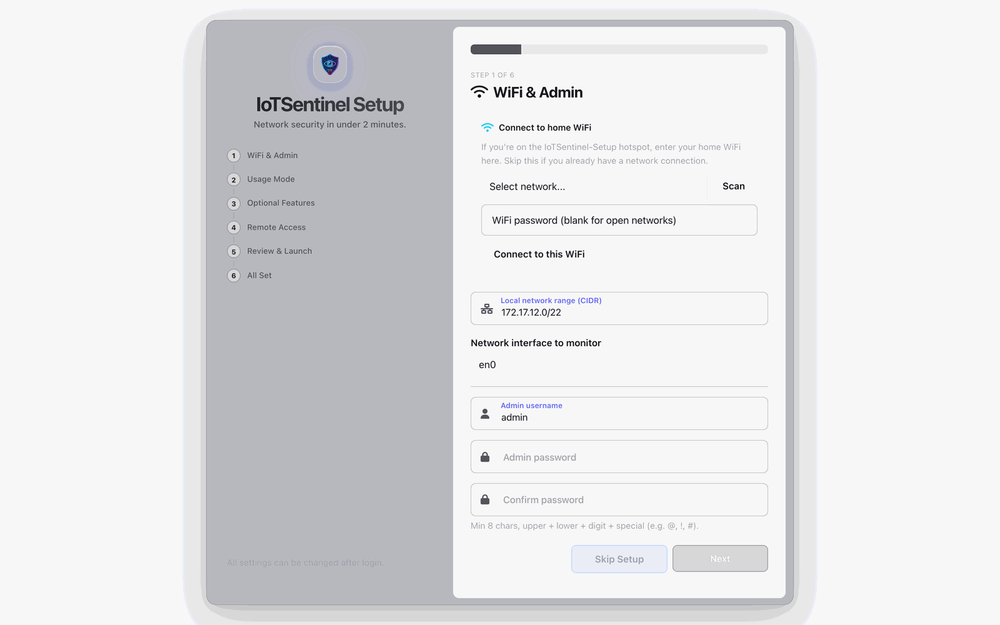
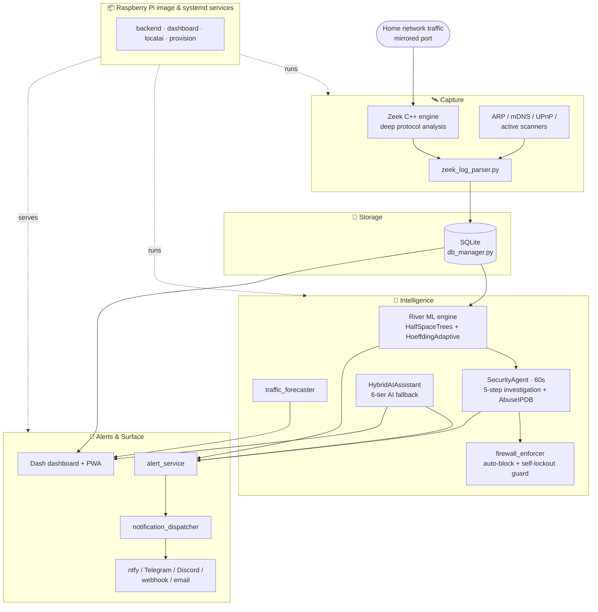

<div align="center">


# IoTSentinel

**Autonomous network security for every home. Runs on a $75 Raspberry Pi.**

[](https://github.com/ritiksah141/iotsentinel/actions/workflows/test.yml)
[](https://github.com/ritiksah141/iotsentinel/actions/workflows/lint.yml)
[](https://github.com/ritiksah141/iotsentinel/actions/workflows/security.yml)
[](LICENSE)
[]()
[-green)]()

### [Download for Raspberry Pi →](https://github.com/ritiksah141/iotsentinel/releases/latest)

Flash `.img.xz` with **Raspberry Pi Imager**, boot, connect to the `IoTSentinel-Setup` WiFi,
and finish the 6-step browser wizard. No terminal required.

</div>

---

Most home networks are invisible to the people who own them. Smart TVs, thermostats, cameras,
and plugs talk to external servers constantly — and there's no way to know when something goes
wrong until a breach has already happened.

**IoTSentinel makes your network visible, understandable, and actively defended.** It runs
entirely on a Raspberry Pi, keeps all your data on-device, and explains every decision it makes
in plain English.

---

## See it in action

> Screenshots live in [`docs/images/`](docs/images/).

| Dashboard overview | Agent investigation timeline |
|---|---|
|  |  |
| Frosted-glass overview: device cards, live anomaly index, traffic-light security score. | The 5-step transparent investigation behind every automated decision. |

| Plain-English alerts + "Ask Why" | Setup wizard / mobile app |
|---|---|
|  |  |
| Every alert rewritten into plain English, with a per-alert AI analyst grounded in your network. | The no-terminal 6-step wizard; installs as a native app on phone and desktop. |

---

## Why IoTSentinel

| | **IoTSentinel** | Firewalla | Fing | Pi-hole |
|---|---|---|---|---|
| **Price** | ~$75 (Pi hardware) | $179–$349 | $99/yr subscription | Free (DNS only) |
| **Traffic analysis** | Deep (Zeek C++ engine) | Yes | Limited | No |
| **Unsupervised ML** | Yes — River, on-device | No | No | No |
| **Autonomous IDS** | Yes — auto-blocks threats | Basic | No | No |
| **AI investigation timeline** | Yes — 5-step, transparent | No | No | No |
| **CVE scanning on join** | Yes — NVD pipeline | No | No | No |
| **Plain-English alerts** | Yes — proactive LLM rewrite | Beta, cloud-only | No | No |
| **Per-alert AI chat** | Yes — grounded in your network | Beta, cloud-only | No | No |
| **AI works fully on-device** | Yes — preinstalled in the Pi image | No, requires their cloud | No | No |
| **Choose your AI provider** | Yes — OpenAI, Claude, Groq, Gemini, local | No, theirs only | No | No |
| **Weekly AI security story** | Yes — auto-narrated | No | No | No |
| **Per-device AI personality** | Yes — from learned baselines | No | No | No |
| **AI source transparency** | Yes — badge per explanation | No | No | No |
| **Privacy** | 100% on-device | Cloud sync | Cloud | Local |
| **Open source** | Yes (MIT) | Partial | No | Yes |

---

## What it does

###  Active intrusion detection

An autonomous `SecurityAgent` polls every 60 seconds. When it detects a threat it doesn't just
notify — it **investigates**, in five transparent steps shown as a color-coded timeline:

1. Device connection history and recent alert count
2. External destinations contacted in the last hour
3. Live [AbuseIPDB](https://abuseipdb.com) reputation lookup for each external IP (cached 24 h)
4. Traffic volume vs. baseline (flags deviations above 1.5×)
5. Policy decision with a plain-English rationale

For **critical threats** (command-and-control, data breach, DDoS) the agent enforces a firewall
block autonomously. A **self-lockout guard** ensures your own IP, the router, and the gateway can
never be blocked, and a **circuit breaker** suspends auto-blocking if 3 devices are blocked within
10 minutes — so a false-positive storm can't lock you out.

###  A privacy-first AI layer

Competitors are bolting cloud AI onto their products — Firewalla's Ask AI (beta) sends your
alarms to LLMs in *their* cloud. IoTSentinel's AI layer is different in kind: **every feature
works fully on-device or offline**, every explanation **shows which engine wrote it**, and you
choose the provider — OpenAI, Claude, Groq, Gemini, a local model, or no cloud at all.

- **Proactive plain-English alerts** — a background worker rewrites every alert as it arrives.
- **Per-alert AI analyst ("Ask Why")** — ask "Why is this bad?", "What should I do?" and get
  answers grounded in the specific device, its baseline, and recent destinations.
- **"This Week on Your Network"** — an auto-narrated weekly security story, also pushed to your
  phone with the Sunday report.
- **Per-device personality profiles** — an AI behavioural summary built from River ML baselines.
- **Natural-language network queries** — ask in plain English; it generates a validated,
  read-only SQL query and answers with a results table.
- **AI source transparency** — every explanation carries a provider badge (Groq, OpenAI, Claude,
  Gemini, Local, or Smart Template). Nothing is anonymous.

<details>
<summary>More AI features</summary>

- **AI new-device triage** — when an unknown device joins, the agent summarises what it likely
  is, whether it looks safe, and what to do, with a Trust / Block card.
- **AI privacy mode** — one toggle switches the stack to Ollama-first, keeping all data and
  explanations on-device. No API keys, nothing leaves the Pi.
- **AI in the box** — the official Pi image installs Ollama and pulls the local model on first
  boot (niced so the dashboard stays responsive). Unplug the internet afterwards and the AI keeps
  explaining. Skipped automatically on low-RAM devices.

The stack uses a **6-tier fallback**: OpenAI `gpt-4o-mini` → Anthropic `claude-haiku-4-5` →
Groq `llama-3.1-8b-instant` → Google `gemini-2.5-flash` → Ollama `gemma2:2b` (local) → smart
rule templates. Config-driven models, response cache, and a provider-health panel are built in.
</details>

###  CVE scanning on device join

When a device first joins, IoTSentinel matches its manufacturer, model, and type against the NVD
vulnerability database. Matched CVEs surface immediately in the device Security tab with CVSS
scores and descriptions — no manual scanning.

###  Real-time ML anomaly detection

[River ML](https://riverml.xyz) — incremental, online learning — scores every device on every
connection, with **no training phase**. Two ensemble algorithms (HalfSpaceTrees and
HoeffdingAdaptive) score traffic against a rolling baseline in real time. The Overview shows the
current anomaly index, risk badge, trend arrow, and per-device breakdown, wired to live data.

###  Frosted-glass dashboard

A mobile-responsive web UI with Apple-vibrancy frosted-glass design, full dark mode, low-power
mode auto-detected from device capabilities, keyboard shortcuts, and Spotlight-style search.
Accessible on your home network or via an optional permanent HTTPS URL (Tailscale Funnel), and
**installable as a native app** on phone and desktop.

---

## Architecture

Everything below runs on the Pi. Arrows to external services are optional and user-configured;
with privacy mode on, nothing leaves the device.



---

## Getting started

### Raspberry Pi (recommended — no terminal)

**1. Flash.** Download `IoTSentinel-<version>.img.xz` from the
[latest release](https://github.com/ritiksah141/iotsentinel/releases/latest). Open
**[Raspberry Pi Imager](https://www.raspberrypi.com/software/)**, select the `.img.xz` and your
SD card, click Write.

**2. Boot and connect.** Insert the card and power on. After ~90 seconds a WiFi network called
**`IoTSentinel-Setup`** appears — connect your phone or laptop, then open `http://10.42.0.1:8050/setup`.

**3. Complete the 6-step wizard.**

| Step | What you configure |
|------|-------------------|
| 1. WiFi & Admin | Home WiFi credentials, admin password |
| 2. Who is this for? | Household or Small Business feature tier |
| 3. Optional features | Email alerts, AI explanations (Groq), local AI (Ollama) + privacy mode, threat intel (AbuseIPDB) |
| 4. Access from anywhere | Optional permanent HTTPS URL via Tailscale Funnel |
| 5. Review | Confirm settings and Launch |
| 6. Done | Reconnect to home WiFi, open `http://iotsentinel.local:8050` |

All API keys are optional — the system works without them using local threat feeds and
rule-based fallbacks.

> **Windows / Android:** `iotsentinel.local` needs Bonjour (ships with iTunes on Windows).
> Without it, use the Pi's IP from your router's connected-devices page.

### Laptop / desktop (macOS / Linux / Windows)

```bash
git clone https://github.com/ritiksah141/iotsentinel.git
cd iotsentinel
bash install.sh        # Windows: install.bat
```

Your browser opens to `http://localhost:8050/setup` and the wizard takes over.

<details>
<summary>Manual install (developers)</summary>

```bash
python3 -m venv venv
source venv/bin/activate          # Windows: venv\Scripts\activate
pip install -r requirements.txt   # laptop; Pi uses requirements-pi.txt
python3 config/init_database.py
python3 dashboard/app.py
```

For a full Raspberry Pi setup (Zeek + all services): `bash scripts/setup_pi.sh`
</details>

---

## Security architecture

**Login protection:** rate limiting (5 failures → 5-minute lockout), bcrypt password hashing,
persistent `SECRET_KEY`, role-based access (Admin / Viewer), and a forced password change when
default credentials are detected on first login.

**Autonomous IDS policy:**

| Severity | Attack type | Action |
|---|---|---|
| critical | C2, data breach, DDoS | Auto-block (device + malicious destination IPs) |
| critical | Any | Auto-block |
| high | Brute force, compromise | Mark suspicious |
| high | Port scan | Notify |
| medium | Any | Notify |
| low | Any | Acknowledge |

Set `config.agent.auto_block.enabled = false` for approval-queue mode — all investigation and
classification continues; only autonomous enforcement pauses.

**Remote access:** optional Tailscale Funnel (wizard step 4) gives a permanent HTTPS URL with no
port forwarding or VPN.

**Install it like an app:** IoTSentinel is a Progressive Web App. Open it over your Tailscale
Funnel HTTPS URL (or `http://localhost:8050` on the Pi) and choose **Install** / **Add to Home
Screen** — it opens in its own window with its own icon, no browser chrome. App install needs a
secure context, so it works over HTTPS or `localhost`, not a plain-LAN `http://` address (the
dashboard still works there, it just isn't installable).

---

## Testing

**997 tests** across 36 files cover the full data pipeline, ML engine, security flows, alert
system, AI feature helpers, device intelligence, and setup wizard. CI runs the suite on Python
3.11 and 3.12, plus an app-boot smoke test and an ARM64 dependency-install check.

| Module | Coverage |
|---|---|
| Zeek parser | 68% |
| Feature extractor | 81% |
| Name resolver | 79% |
| DB manager | 72% |
| Email notifier | 73% |
| Alert service | 78% |

```bash
pytest tests/                          # all 997 tests
pytest tests/ -x                       # stop at first failure
./scripts/run_tests.sh report          # HTML coverage report
```

See **[tests/README.md](tests/README.md)** for full test documentation.

---

## Technology stack

| Layer | Technology |
|---|---|
| Capture | Zeek (formerly Bro) — enterprise-grade C++ network analysis |
| Backend | Python 3.11, SQLite |
| ML | River — HalfSpaceTrees, HoeffdingAdaptive, SNARIMAX |
| AI | `HybridAIAssistant` — 6-tier fallback (OpenAI `gpt-4o-mini`, Anthropic `claude-haiku-4-5`, Groq `llama-3.1-8b-instant`, Google `gemini-2.5-flash`, Ollama `gemma2:2b`, rule templates) with config-driven models, response cache, and a provider-health panel |
| IDS | Custom `SecurityAgent` — autonomous 5-step investigation |
| Frontend | Dash by Plotly — frosted-glass, dark mode, mobile-responsive, PWA |
| Notifications | ntfy, Telegram, Discord, email, webhook |
| Hardware | Raspberry Pi 4 or 5 (4 GB RAM recommended) |

---

## Roadmap

Post-v1.0.0, in priority order:

- **Incident Stories** — correlate related alerts into one narrated attack chain: "Your camera
  was port-scanned at 9:14, then attempted SSH to your NAS at 9:20." One incident, one story,
  one decision — instead of a pile of separate alerts.
- **One-Tap AI Action Plans** — the AI proposes a complete, reviewable response ("block for 24 h,
  notify me, auto-unblock, watch for recurrence") executed through the existing firewall enforcer
  with the circuit breaker and self-lockout guard.
- **Predictive Deviation Alerts** — the on-device forecaster learns each device's daily rhythm
  and narrates breaks from it: "Your camera is normally silent between 1 and 5 am. It just started
  uploading."

---

## Documentation

- **[tests/README.md](tests/README.md)** — full test-suite documentation
- **[.github/CHANGELOG.md](.github/CHANGELOG.md)** — full version history
- **[.github/SECURITY.md](.github/SECURITY.md)** — security policy and responsible disclosure

---

## License

MIT — see [LICENSE](LICENSE).
