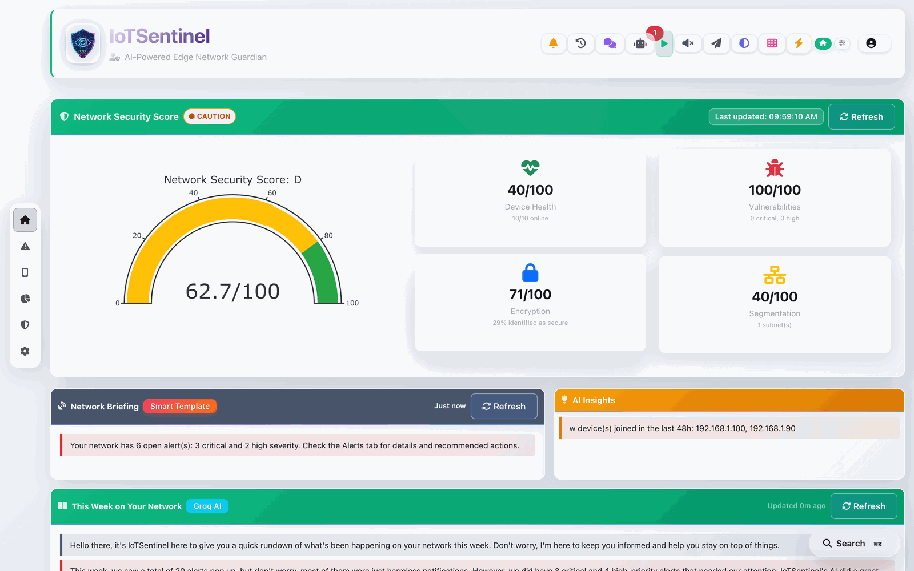
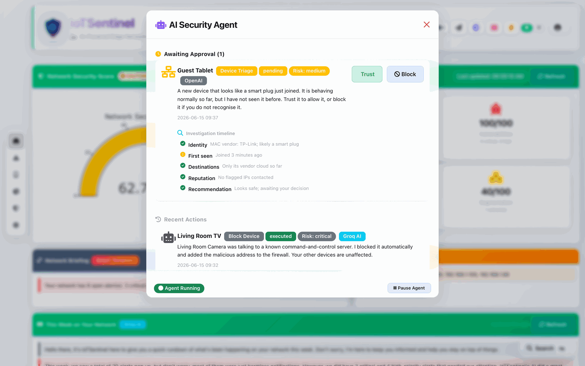
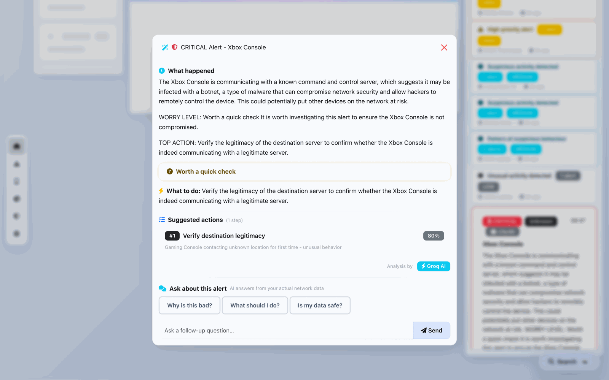
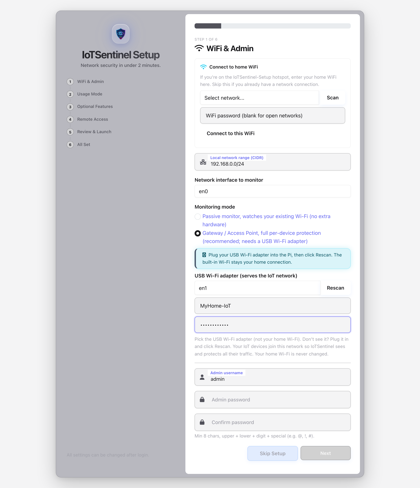
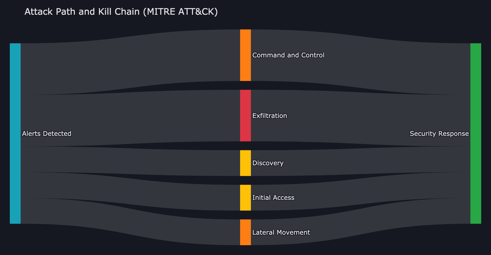
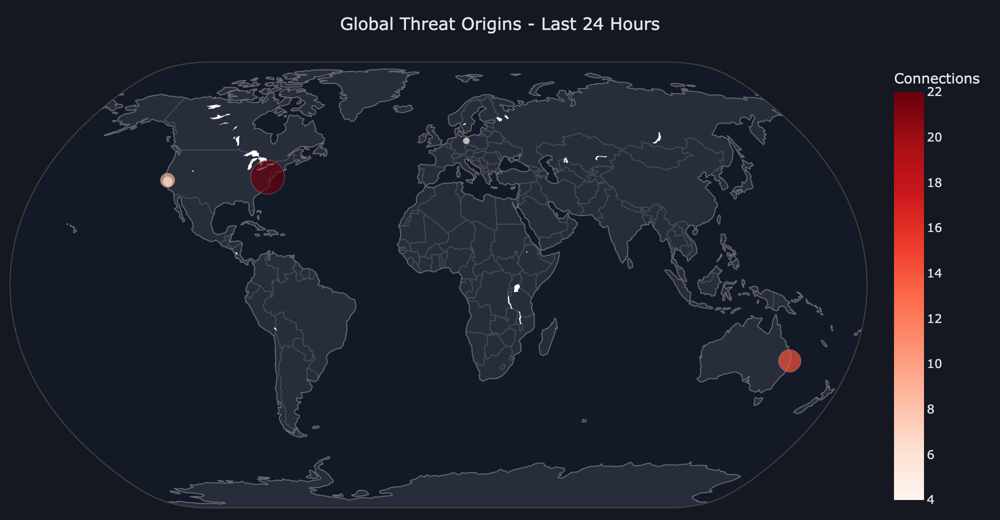
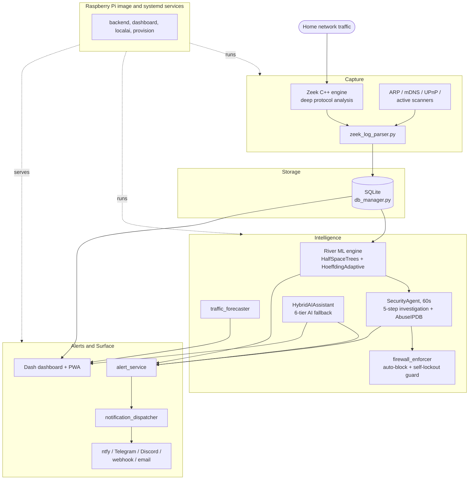
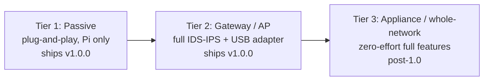

<div align="center">


# IoTSentinel

**Autonomous network security for every home. Runs on a $75 Raspberry Pi.**

[](https://github.com/ritiksah141/iotsentinel/actions/workflows/test.yml)
[](https://github.com/ritiksah141/iotsentinel/actions/workflows/lint.yml)
[](https://github.com/ritiksah141/iotsentinel/actions/workflows/security.yml)
[](LICENSE)
[]()
[-green)]()

### [Download for Raspberry Pi](https://github.com/ritiksah141/iotsentinel/releases/latest)

Flash `.img.xz` with **Raspberry Pi Imager**, boot, connect to the `IoTSentinel-Setup` WiFi,
and finish the browser wizard. No terminal required.

</div>

---

Most home networks are invisible to the people who own them. Smart TVs, thermostats, cameras,
and plugs talk to external servers constantly, and there is no way to know when something goes
wrong until a breach has already happened.

**IoTSentinel makes your network visible, understandable, and actively defended.** It runs
entirely on a Raspberry Pi, keeps all your data on-device, and explains every decision it makes
in plain English.

---

## See it in action

> Screenshots live in [`docs/images/`](docs/images/).

| Dashboard overview | Agent investigation timeline |
|---|---|
|  |  |
| Frosted-glass overview: device cards, live anomaly index, traffic-light security score. | The 5-step transparent investigation behind every automated decision. |

| Plain-English alerts and "Ask Why" | No-terminal browser setup |
|---|---|
|  |  |
| Every alert rewritten into plain English, with a per-alert AI analyst grounded in your network. | The whole setup runs in the browser. Choose Passive (Pi only) or Gateway; Gateway reveals the USB-adapter fields. Installs as a native app afterward. |

| Attack path and kill chain | Global threat distribution |
|---|---|
|  |  |
| Alerts mapped to MITRE ATT&CK stages, from detection to security response. | Where your devices connect on the internet over the last 24 hours, geolocated. |

---

## Why IoTSentinel

| | **IoTSentinel** | Firewalla | Fing | Pi-hole |
|---|---|---|---|---|
| **Price** | ~$75 (Pi hardware) | $179 to $349 | $99/yr subscription | Free (DNS only) |
| **Traffic analysis** | Deep (Zeek C++ engine) | Yes | Limited | No |
| **Unsupervised ML** | Yes, River, on-device | No | No | No |
| **Autonomous IDS/IPS** | Yes, auto-blocks threats | Basic | No | No |
| **AI investigation timeline** | Yes, 5-step, transparent | No | No | No |
| **CVE scanning on join** | Yes, NVD pipeline | No | No | No |
| **Plain-English alerts** | Yes, proactive LLM rewrite | Beta, cloud-only | No | No |
| **Per-alert AI chat** | Yes, grounded in your network | Beta, cloud-only | No | No |
| **AI works fully on-device** | Yes, preinstalled in the Pi image | No, requires their cloud | No | No |
| **Choose your AI provider** | Yes: OpenAI, Claude, Groq, Gemini, local | No, theirs only | No | No |
| **Weekly AI security story** | Yes, auto-narrated | No | No | No |
| **Per-device AI personality** | Yes, from learned baselines | No | No | No |
| **AI source transparency** | Yes, badge per explanation | No | No | No |
| **Privacy** | 100% on-device | Cloud sync | Cloud | Local |
| **Open source** | Yes (MIT) | Partial | No | Yes |

---

## Monitoring modes

IoTSentinel offers two modes, both chosen in the browser wizard with no command line.

**Where it runs.** A Raspberry Pi 4 or 5 is the recommended always-on appliance. You can also
run real monitoring on a spare PC or a Linux virtual machine (bridged networking), or just try the
dashboard on your everyday Mac, Windows, or Linux computer with demo data. See the
[setup guide](docs/SETUP_GUIDE.md) for all four paths.

**Passive (plug-and-play).** The default. The Pi (or PC / VM) watches your network and
gives you device inventory, new-device alerts, firmware end-of-life and vulnerability posture,
DNS-level threat intelligence, the full dashboard, and the local AI explanations. Zero extra
hardware, zero configuration.

**Gateway / Access Point (full intrusion detection and prevention).** With one AP-capable USB
Wi-Fi adapter, the Pi serves a dedicated Wi-Fi network for your IoT devices and sees all of their
traffic. This unlocks per-device anomaly detection, data-exfiltration and command-and-control
detection, and inline blocking of any device. The Pi joins your home Wi-Fi as a normal client for
its own internet, so your home Wi-Fi is never changed. See
[`docs/GATEWAY_MODE.md`](docs/GATEWAY_MODE.md) for setup, and [`docs/ROADMAP.md`](docs/ROADMAP.md)
for how the modes map to the product roadmap.

```mermaid
flowchart TD
  NET([Internet]) --> R["Home router"]
  R -->|Wi-Fi| HOME["Phones and laptops<br/>untouched"]
  R -->|Wi-Fi uplink, no cable| PI

  subgraph PI["Raspberry Pi running IoTSentinel"]
    W0["wlan0: home Wi-Fi client (uplink)"]
    W1["wlan1 USB: IoTSentinel access point"]
    ENG["Zeek capture + River ML + inline block"]
  end

  PI -->|IoTSentinel Wi-Fi| IOT["IoT devices<br/>camera, plug, TV"]
  IOT -->|all traffic and DNS| ENG
```



> Inline blocking enforces on traffic that flows through the Pi (gateway mode). In passive mode,
> network-wide blocking is available through a supported OpenWrt router.

---

## What it does

### Active intrusion detection and prevention

An autonomous `SecurityAgent` polls every 60 seconds. When it detects a threat it does not just
notify, it **investigates**, in five transparent steps shown as a color-coded timeline:

1. Device connection history and recent alert count
2. External destinations contacted in the last hour
3. Live [AbuseIPDB](https://abuseipdb.com) reputation lookup for each external IP (cached 24 h)
4. Traffic volume vs. baseline (flags deviations above 1.5x)
5. Policy decision with a plain-English rationale

For **critical threats** (command-and-control, data breach, DDoS) the agent enforces a firewall
block autonomously. A **self-lockout guard** ensures your own device, the router, and the gateway
can never be blocked, and a **circuit breaker** suspends auto-blocking if 3 devices are blocked
within 10 minutes, so a false-positive storm can never lock you out.

### A privacy-first AI layer

Competitors are bolting cloud AI onto their products. Firewalla's Ask AI (beta) sends your alarms
to LLMs in *their* cloud. IoTSentinel's AI layer is different in kind: **every feature works fully
on-device or offline**, every explanation **shows which engine wrote it**, and you choose the
provider: OpenAI, Claude, Groq, Gemini, a local model, or no cloud at all.

- **Proactive plain-English alerts.** A background worker rewrites every alert as it arrives.
- **Per-alert AI analyst ("Ask Why").** Ask "Why is this bad?" or "What should I do?" and get
  answers grounded in the specific device, its baseline, and recent destinations.
- **"This Week on Your Network".** An auto-narrated weekly security story, also pushed to your
  phone with the Sunday report.
- **Per-device personality profiles.** An AI behavioural summary built from River ML baselines.
- **Natural-language network queries.** Ask in plain English; it generates a validated, read-only
  SQL query and answers with a results table.
- **AI source transparency.** Every explanation carries a provider badge (Groq, OpenAI, Claude,
  Gemini, Local, or Smart Template). Nothing is anonymous.

<details>
<summary>More AI features</summary>

- **AI new-device triage.** When an unknown device joins, the agent summarises what it likely is,
  whether it looks safe, and what to do, with a Trust or Block card.
- **AI privacy mode.** One toggle switches the stack to Ollama-first, keeping all data and
  explanations on-device. No API keys, nothing leaves the Pi.
- **AI in the box.** The official Pi image installs Ollama and pulls the local model on first boot
  (niced so the dashboard stays responsive). Unplug the internet afterwards and the AI keeps
  explaining. Skipped automatically on low-RAM devices.

The stack uses a **6-tier fallback**: OpenAI `gpt-4o-mini`, then Anthropic `claude-haiku-4-5`,
then Groq `llama-3.1-8b-instant`, then Google `gemini-2.5-flash`, then Ollama `gemma2:2b` (local),
then smart rule templates. Config-driven models, response cache, and a provider-health panel are
built in.
</details>

### CVE scanning on device join

When a device first joins, IoTSentinel matches its manufacturer, model, and type against the NVD
vulnerability database. Matched CVEs surface immediately in the device Security tab with CVSS
scores and descriptions. No manual scanning.

### Real-time ML anomaly detection

[River ML](https://riverml.xyz), incremental online learning, scores every device on every
connection, with **no training phase**. Two ensemble algorithms (HalfSpaceTrees and
HoeffdingAdaptive) score traffic against a rolling baseline in real time. The Overview shows the
current anomaly index, risk badge, trend arrow, and per-device breakdown, wired to live data.

### Frosted-glass dashboard

A mobile-responsive web UI with Apple-vibrancy frosted-glass design, full dark mode, low-power
mode auto-detected from device capabilities, keyboard shortcuts, and Spotlight-style search.
Accessible on your home network or via an optional permanent HTTPS URL (Tailscale Funnel), and
**installable as a native app** on phone and desktop.

---

## Architecture

Everything below runs on the Pi. Arrows to external services are optional and user-configured.
With privacy mode on, nothing leaves the device.



---

## What you need

- **Passive mode:** a Raspberry Pi 4 or 5 (4 GB RAM recommended), an SD card or SSD, and power.
  Nothing else.
- **Full intrusion detection and prevention (gateway mode):** the above plus one AP-capable USB
  Wi-Fi adapter (for example MT7612U, MT7610U, or RTL8811AU/8812AU). No cables.

---

## Getting started

### Raspberry Pi (recommended, no terminal)

> 📖 **Full step-by-step guide:** [`docs/SETUP_GUIDE.md`](docs/SETUP_GUIDE.md) - written for
> non-technical users, with every click and a troubleshooting section. The same guide ships
> **inside the downloaded image package** as `IoTSentinel-Setup-Guide.html`, so you don't need
> to come back to GitHub.


**1. Flash.** Download `IoTSentinel-<version>.img.xz` from the
[latest release](https://github.com/ritiksah141/iotsentinel/releases/latest). Open
**[Raspberry Pi Imager](https://www.raspberrypi.com/software/)**, choose **Use custom** and select
the `.img.xz`, pick your SD card, click **Write**. When Imager asks about applying OS customisation
settings, click **NO** - don't enter Wi-Fi or a password there; the Pi's own wizard does that.

**2. Boot and connect.** Insert the card and power on (no screen or keyboard needed). After about
2 minutes an **open** WiFi network called **`IoTSentinel-Setup`** appears - join it from your phone,
then open `http://10.42.0.1:8050/setup`.

**3. Complete the wizard.**

| Step | What you configure |
|------|-------------------|
| WiFi and Admin | Home WiFi credentials, admin password |
| Monitoring mode | Passive (Pi only) or Gateway (full IDS/IPS with a USB Wi-Fi adapter) |
| Who is this for? | Household or Small Business feature tier |
| Optional features | Email alerts, AI explanations (Groq), local AI (Ollama) and privacy mode, threat intel (AbuseIPDB) |
| Access from anywhere | Optional permanent HTTPS URL via Tailscale Funnel |
| Review | Confirm settings and Launch |

All API keys are optional. The system works without them using local threat feeds and rule-based
fallbacks.

> **Windows / Android:** `iotsentinel.local` needs Bonjour (ships with iTunes on Windows). Without
> it, use the Pi's IP address - the final wizard screen and **Quick Settings → Network** both show it, so
> you don't need to dig it out of your router.

> **Moved house or changed your router?** You're never locked out: use **Quick Settings → Network → Change
> WiFi** to switch networks, and if the Pi ever loses Wi-Fi it re-opens the `IoTSentinel-Setup`
> hotspot automatically so you can reconnect it. See [`docs/SETUP_GUIDE.md`](docs/SETUP_GUIDE.md).

### Laptop / desktop (macOS / Linux / Windows)

```bash
git clone https://github.com/ritiksah141/iotsentinel.git
cd iotsentinel
bash install.sh        # Windows: install.bat
```

Your browser opens to `http://localhost:8050/setup` and the wizard takes over.

<details>
<summary>Manual install (developers)</summary>

```bash
python3 -m venv venv
source venv/bin/activate          # Windows: venv\Scripts\activate
pip install -r requirements.txt   # laptop; Pi uses requirements-pi.txt
python3 config/init_database.py
python3 dashboard/app.py
```

For a full Raspberry Pi setup (Zeek and all services): `bash scripts/setup_pi.sh`. To enable and
verify gateway mode on the Pi: `bash scripts/validate_gateway.sh`.
</details>

---

## Security architecture

**Login protection:** rate limiting (5 failures trigger a 5-minute lockout), bcrypt password
hashing, persistent `SECRET_KEY`, role-based access (Admin / Viewer), and a forced password change
when default credentials are detected on first login.

**Autonomous IDS/IPS policy:**

| Severity | Attack type | Action |
|---|---|---|
| critical | C2, data breach, DDoS | Auto-block (device and malicious destination IPs) |
| critical | Any | Auto-block |
| high | Brute force, compromise | Mark suspicious |
| high | Port scan | Notify |
| medium | Any | Notify |
| low | Any | Acknowledge |

Set `config.agent.auto_block.enabled = false` for approval-queue mode. All investigation and
classification continues; only autonomous enforcement pauses.

**Inline enforcement safety (gateway mode):** the firewall never blocks the home router, the Pi's
access-point gateway, or your own device, and a connectivity watchdog rolls the access point back
to passive if it ever disrupts the home uplink, so the setup cannot break your internet.

**Remote access:** optional Tailscale Funnel (a wizard step) gives a permanent HTTPS URL with no
port forwarding or VPN.

**Install it like an app:** IoTSentinel is a Progressive Web App. Open it over your Tailscale
Funnel HTTPS URL (or `http://localhost:8050` on the Pi) and choose **Install** or **Add to Home
Screen**. It opens in its own window with its own icon, no browser chrome. App install needs a
secure context, so it works over HTTPS or `localhost`, not a plain-LAN `http://` address (the
dashboard still works there, it just is not installable).

---

## Testing

**1143 tests** across 44 files cover the full data pipeline, ML engine, security flows, alert
system, AI feature helpers, device intelligence, capture-mode and gateway logic, Wi-Fi / hotspot
recovery, and the setup wizard. CI runs the suite on Python 3.11 and 3.12, plus an app-boot smoke
test and an ARM64 dependency-install check.

| Module | Coverage |
|---|---|
| Zeek parser | 68% |
| Feature extractor | 81% |
| Name resolver | 79% |
| DB manager | 72% |
| Email notifier | 73% |
| Alert service | 78% |

```bash
pytest tests/                          # all 1143 tests
pytest tests/ -x                       # stop at first failure
./scripts/run_tests.sh report          # HTML coverage report
```

See **[tests/README.md](tests/README.md)** for full test documentation.

---

## Technology stack

| Layer | Technology |
|---|---|
| Capture | Zeek (formerly Bro), enterprise-grade C++ network analysis |
| Backend | Python 3.11, SQLite |
| ML | River: HalfSpaceTrees, HoeffdingAdaptive, SNARIMAX |
| AI | `HybridAIAssistant`, 6-tier fallback (OpenAI `gpt-4o-mini`, Anthropic `claude-haiku-4-5`, Groq `llama-3.1-8b-instant`, Google `gemini-2.5-flash`, Ollama `gemma2:2b`, rule templates) with config-driven models, response cache, and a provider-health panel |
| IDS/IPS | Custom `SecurityAgent` with autonomous 5-step investigation and inline `firewall_enforcer` |
| Gateway | NetworkManager shared-mode access point on a USB Wi-Fi adapter |
| Frontend | Dash by Plotly: frosted-glass, dark mode, mobile-responsive, PWA |
| Notifications | ntfy, Telegram, Discord, email, webhook |
| Hardware | Raspberry Pi 4 or 5 (4 GB RAM recommended) |

---

## What ships in v1.0.0

v1.0.0 is a complete, no-terminal product. Everything is driven by the on-screen wizard and the
dashboard.

- **Passive monitoring (plug-and-play):** device discovery, new-device alerts, firmware and
  vulnerability posture, DNS-level threat intelligence, the full dashboard, and the on-device AI
  explanations. Works on a Raspberry Pi alone.
- **Gateway intrusion detection and prevention:** full per-device traffic capture, ML anomaly
  detection, exfiltration and command-and-control detection, MITRE ATT&CK kill-chain mapping, and
  inline block and allow, all wired through the wizard. Needs one USB Wi-Fi adapter.
- **The complete AI layer:** proactive plain-English alerts, the per-alert "Ask Why" analyst, the
  weekly security story, per-device personalities, natural-language queries, and provider
  transparency, with a fully on-device privacy mode.
- **Multi-channel notifications, remote access, and PWA install** as described above.

---

## What's next

Product tiers, from what ships today to the plug-and-play future:



The roadmap, in priority order:

- **Appliance and whole-network gateway.** A pre-built unit and an inline or router placement so
  full intrusion detection and prevention reaches the whole network with no device re-pairing. See
  [`docs/ROADMAP.md`](docs/ROADMAP.md).
- **Incident Stories.** Correlate related alerts into one narrated attack chain: "Your camera was
  port-scanned at 9:14, then attempted SSH to your NAS at 9:20." One incident, one story, one
  decision, instead of a pile of separate alerts.
- **One-Tap AI Action Plans.** The AI proposes a complete, reviewable response ("block for 24 h,
  notify me, auto-unblock, watch for recurrence") executed through the existing firewall enforcer
  with the circuit breaker and self-lockout guard.
- **Predictive Deviation Alerts.** The on-device forecaster learns each device's daily rhythm and
  narrates breaks from it: "Your camera is normally silent between 1 and 5 am. It just started
  uploading."

---

## Documentation

- **[docs/GATEWAY_MODE.md](docs/GATEWAY_MODE.md)**, gateway and access-point setup
- **[docs/ROADMAP.md](docs/ROADMAP.md)**, product tiers and roadmap
- **[tests/README.md](tests/README.md)**, full test-suite documentation
- **[.github/CHANGELOG.md](.github/CHANGELOG.md)**, full version history
- **[.github/SECURITY.md](.github/SECURITY.md)**, security policy and responsible disclosure
- **[docs/PRIVACY.md](docs/PRIVACY.md)**, privacy policy and data handling (draft)
- **[docs/TERMS.md](docs/TERMS.md)**, terms of use (draft)

---

## License

MIT. See [LICENSE](LICENSE).
