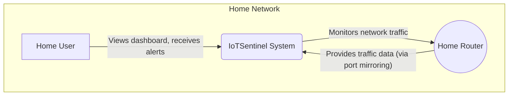

# C4 Model: Level 1 - System Context

**Diagramming Tool**: Mermaid  
**Last Updated**: November 2025

This diagram provides a high-level overview of the IoTSentinel system, its users, and the external systems it interacts with.

## System Context Diagram

## Entities

### 1. Home User

- **Type**: Actor
- **Description**: The primary user of the system, typically a non-technical homeowner who wants to monitor their network for suspicious activity.
- **Interactions**:
  - Views the web dashboard to see network status and alerts.
  - Receives simplified, educational explanations of detected anomalies.
  - Manages the system (e.g., starts baseline collection, acknowledges alerts).

### 2. IoTSentinel System

- **Type**: System
- **Description**: The complete IoTSentinel application running on a Raspberry Pi. It monitors network traffic, detects anomalies using machine learning, and presents the findings on a web dashboard.
- **Responsibilities**:
  - Capturing and analyzing network traffic.
  - Storing connection metadata.
  - Training unsupervised machine learning models.
  - Detecting anomalies in real-time.
  - Generating and explaining security alerts.

### 3. Home Router

- **Type**: External System
- **Description**: The user's home internet router, which manages all network traffic.
- **Interactions**:
  - IoTSentinel monitors all traffic passing through the router. This is typically achieved by configuring the router to mirror all network traffic to the Ethernet port where the Raspberry Pi is connected.
