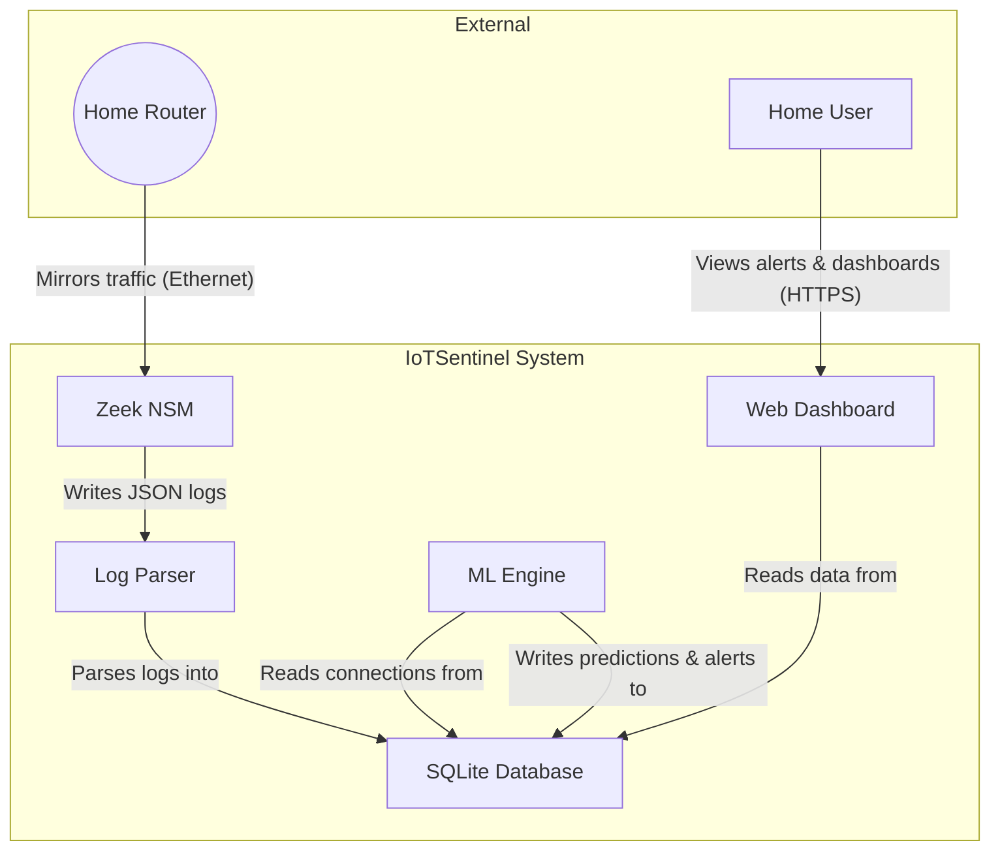

# C4 Model: Level 2 - Container Diagram

**Diagramming Tool**: Mermaid  
**Last Updated**: November 2025

This diagram zooms into the IoTSentinel system and shows its main containers (applications/services).

## Container Diagram

## Container Details

| Container           | Technology         | Responsibility                                                                  | Communication Protocols                              |
| ------------------- | ------------------ | ------------------------------------------------------------------------------- | ---------------------------------------------------- |
| **Zeek NSM**        | C++                | Analyzes raw network packets and generates structured JSON logs for events.     | Reads raw packets; Writes to local JSON files.       |
| **Log Parser**      | Python             | Watches for new Zeek logs, parses them, and inserts the data into the database. | Reads local JSON files; Writes to SQLite via SQL.    |
| **SQLite Database** | SQLite             | Provides persistent storage for all network data, predictions, and alerts.      | Accessed via file-based SQL queries.                 |
| **ML Engine**       | Python, TensorFlow | Periodically fetches new data, runs ML models, and generates alerts.            | Reads from and writes to SQLite via SQL.             |
| **Web Dashboard**   | Python, Dash       | Presents data and alerts to the user in a web interface.                        | Reads from SQLite via SQL; Serves HTTPS to the user. |

## Architectural Decisions

### ADR-001: Separation of Zeek and Python

- **Context**: We need high-performance packet analysis and flexible machine learning capabilities.
- **Decision**: Use Zeek (C++) for the heavy lifting of network analysis and Python for the data processing and ML pipeline.
- **Consequences**:
  - **Pro**: Zeek is highly optimized and can handle high traffic volumes that a pure Python solution (like one using Scapy) would struggle with.
  - **Pro**: Python provides a rich ecosystem for machine learning and data analysis.
  - **Con**: Introduces a dependency on a file-based communication channel (JSON logs), which adds some latency and complexity.

### ADR-002: Choice of SQLite

- **Context**: The system needs a simple, embedded, and reliable database that requires zero configuration.
- **Decision**: Use SQLite as the primary data store.
- **Consequences**:
  - **Pro**: Extremely easy to set up and manage, as it's just a single file. Perfect for an embedded device like a Raspberry Pi.
  - **Pro**: Sufficiently performant for the project's scale, especially with WAL (Write-Ahead Logging) mode enabled.
  - **Con**: Does not handle high levels of concurrent writes well, though this is mitigated by having separate processes for parsing and inference.
