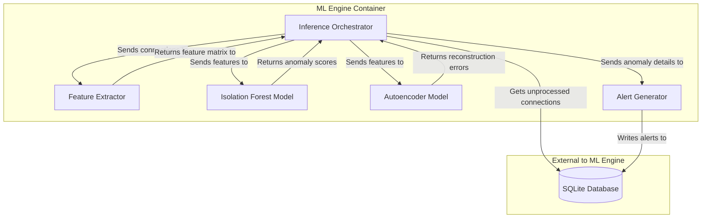

# C4 Model: Level 3 - Component Diagram (ML Engine)

**Diagramming Tool**: Mermaid  
**Last Updated**: November 2025

This diagram zooms into the **ML Engine** container to show its internal components.

## ML Engine Component Diagram

## Component Details

| Component                  | Technology / Logic                          | Responsibility                                                                                                              |
| -------------------------- | ------------------------------------------- | --------------------------------------------------------------------------------------------------------------------------- |
| **Inference Orchestrator** | Python (`ml/inference_engine.py`)           | The main control loop. Fetches data from the database, coordinates the other components, and decides if an alert is needed. |
| **Feature Extractor**      | Python, Pandas (`ml/feature_extractor.py`)  | Takes raw connection data and generates over 15 numerical features (e.g., `bytes_ratio`, `hour_of_day`).                    |
| **Isolation Forest Model** | Python, scikit-learn (`data/models/...pkl`) | A pre-trained model that quickly identifies anomalies by "isolating" them. Returns a raw anomaly score.                     |
| **Autoencoder Model**      | Python, TensorFlow (`data/models/...h5`)    | A pre-trained neural network that tries to reconstruct the input features. High reconstruction error suggests an anomaly.   |
| **Alert Generator**        | Python (`ml/inference_engine.py`)           | Takes the anomaly scores and feature data to generate a human-readable explanation and a severity level for the alert.      |

## Architectural Decisions

### ADR-003: Dual-Model Approach

- **Context**: A single ML model might have blind spots. For example, Isolation Forest is fast but can be less precise, while Autoencoders are more complex but can detect more subtle anomalies.
- **Decision**: Use both an Isolation Forest and an Autoencoder model. An alert is considered "critical" only if both models flag a connection as anomalous.
- **Consequences**:
  - **Pro**: Reduces the rate of false positives, as an anomaly must be confirmed by two different modeling techniques.
  - **Pro**: Allows for a more nuanced severity scoring system.
  - **Con**: Increases computational overhead and inference time, but this is managed by batch processing.
