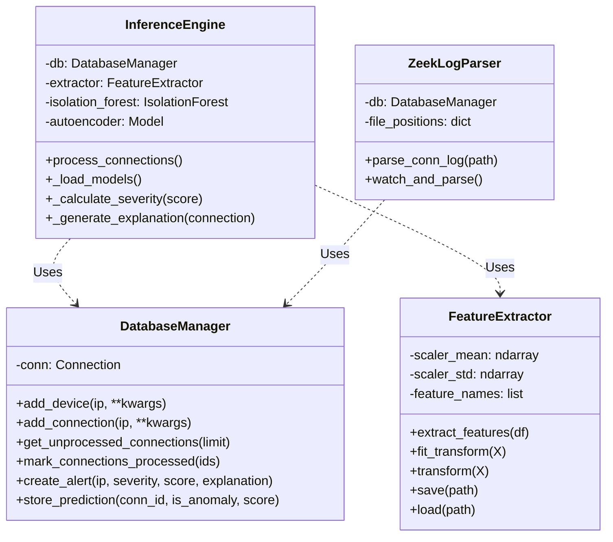

# C4 Model: Level 4 - Code (Key Classes)

**Diagramming Tool**: Mermaid  
**Last Updated**: November 2025

This diagram zooms into key components to show the main classes and their relationships.

## Class Diagram

## Class Details

### `InferenceEngine`

- **File**: `ml/inference_engine.py`
- **Responsibility**: Orchestrates the entire anomaly detection process.
- **Attributes**:
  - `db`: An instance of `DatabaseManager` to interact with the database.
  - `extractor`: An instance of `FeatureExtractor` to generate ML features.
  - `isolation_forest`, `autoencoder`: The loaded machine learning models.
- **Key Methods**:
  - `process_connections()`: The main method that fetches data, runs predictions, and creates alerts.

### `FeatureExtractor`

- **File**: `ml/feature_extractor.py`
- **Responsibility**: Converts raw connection data from the database into a numerical feature matrix suitable for machine learning.
- **Attributes**:
  - `scaler_mean`, `scaler_std`: The mean and standard deviation values for standardizing the data.
- **Key Methods**:
  - `extract_features()`: Performs the main feature engineering.
  - `fit_transform()`: Fits the scaler to the data and standardizes it.
  - `transform()`: Standardizes new data using the already-fitted scaler.

### `DatabaseManager`

- **File**: `database/db_manager.py`
- **Responsibility**: Handles all interactions with the SQLite database, providing a clean API for the rest of the application.
- **Attributes**:
  - `conn`: The active SQLite connection object.
- **Key Methods**:
  - `add_connection()`: Inserts a new connection record.
  - `get_unprocessed_connections()`: Retrieves connections that the ML engine has not yet seen.
  - `create_alert()`: Inserts a new security alert into the database.

### `ZeekLogParser`

- **File**: `capture/zeek_log_parser.py`
- **Responsibility**: Reads Zeek's JSON output logs and uses the `DatabaseManager` to persist the relevant data.
- **Attributes**:
  - `db`: An instance of `DatabaseManager`.
- **Key Methods**:
  - `parse_conn_log()`: Parses the `conn.log` file.
  - `watch_and_parse()`: Continuously monitors the log directory for new entries.
