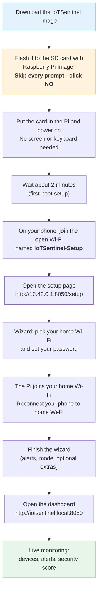

# IoTSentinel Setup Guide

**Four ways to run IoTSentinel - pick the one that matches your situation.**

| | Path A - Raspberry Pi | Path B - Your computer (demo) | Path C - Pi (manual) | Path D - Spare PC or Linux VM |
|---|---|---|---|---|
| **Who** | Home users who want a dedicated always-on monitor | Anyone who wants to explore the dashboard first | Developers / advanced users | Home users with a spare PC or VM instead of a Pi |
| **Effort** | Flash SD card → boot → browser wizard | One command | Terminal steps | One command on Debian/Ubuntu |
| **Network capture** | Full (Zeek on the Pi) | Simulated / demo data | Full (Zeek on the Pi) | Full (Zeek), real passive capture |

> **Demo vs real monitoring.** Path B (your everyday Mac/Windows/Linux computer) runs
> the dashboard on **simulated data** so you can try the interface with zero risk. To
> actually watch your network without a Raspberry Pi, use **Path D** (a spare PC or a
> Linux virtual machine), which installs Zeek and captures for real.

---

## Path A - Raspberry Pi (recommended for home use)

**The whole setup, at a glance:**



### What you need

| Item | Notes |
|---|---|
| Raspberry Pi 5 - 4 GB RAM | Pi 4 (4 GB+) also works |
| microSD card - 16 GB minimum | Class 10 / A2 speed rating recommended |
| USB-C power supply - 5 V / 5 A | Official Pi 5 supply recommended; a phone charger may not provide enough power |
| SD card reader | Built into most laptops or cheap USB adapter |
| Your home Wi-Fi password | |

**Software on your computer:** Python 3.9 or newer is required for Path B only. Path A (Pi image) needs only a browser.

---

### Step 1 - Download

Go to the [**latest release**](https://github.com/ritiksah141/iotsentinel/releases/latest) and download:

- `IoTSentinel-<version>.img.xz` - the pre-built image (~2-3 GB compressed). The filename matches the release tag (e.g. `IoTSentinel-v1.2.0.img.xz`).
- `IoTSentinel-<version>.img.xz.sha256` - optional checksum for verification
- `IoTSentinel-Setup-Guide.html` - this guide, as a page you can open in any browser (double-click it)

**Optional - verify the download:**

```bash
# macOS / Linux
sha256sum -c IoTSentinel-<version>.img.xz.sha256

# Windows PowerShell
(Get-FileHash IoTSentinel-<version>.img.xz -Algorithm SHA256).Hash
```

---

### Step 2 - Write the image to the SD card

You only need the free **Raspberry Pi Imager** app. Follow these clicks exactly - and
importantly, **skip every extra question it asks**. IoTSentinel sets up Wi-Fi and your
password in its own wizard later, so there is nothing to fill in here.

1. Download and open **[Raspberry Pi Imager](https://www.raspberrypi.com/software/)** (it's the official Raspberry Pi app for Mac, Windows, and Linux).
2. Plug your SD card into your computer.
3. Click **CHOOSE DEVICE** and pick your Raspberry Pi model (if it isn't listed, just continue).
4. Click **CHOOSE OS**, scroll to the very bottom, and pick **Use custom**. Then select the `IoTSentinel-<version>.img.xz` file you downloaded in Step 1.
5. Click **CHOOSE STORAGE** and select your SD card. Make sure it's the SD card and not another drive - everything on it gets erased.
6. Click **NEXT**.
7. **Skip the customisation - this is the important part.** Imager will ask: *"Would you like to apply OS customisation settings?"* Click **NO**.
   - Do **not** click "Edit Settings".
   - Do **not** type in a Wi-Fi name, username, or password here.
   - If your version shows a simple on/off toggle instead, leave it **off**.
8. If it warns that the card will be erased, click **YES**, then wait about 5 minutes for it to finish.

> **Why skip it?** If you enter your Wi-Fi in Imager, the Pi quietly joins your home network and never shows the setup screen. Leaving it blank is what makes the Pi open its own `IoTSentinel-Setup` network so you can do everything from your phone.

---

### Step 3 - Power on and open the setup screen

1. Take the SD card out of your computer and put it into the Raspberry Pi.
2. Plug in the power cable. The Pi will start up on its own - **there is no screen, keyboard, or cable to connect.**
3. Wait about **2 minutes** the first time (it's getting itself ready).
4. On your **phone or laptop**, open the Wi-Fi list. A new network called **`IoTSentinel-Setup`** will appear - it has **no password**. Tap it to connect.
5. A setup page should pop up on its own. If it doesn't, open your web browser and go to **`http://10.42.0.1:8050/setup`**.

> Don't see `IoTSentinel-Setup` after a couple of minutes? Unplug the Pi, wait 5 seconds, plug it back in, and wait again. Make sure you're using a proper Raspberry Pi power supply - a weak phone charger can stop the Wi-Fi from starting. Still nothing? See [Troubleshooting](#troubleshooting).

---

### Step 4 - Follow the setup wizard

The setup page walks you through six short steps. Everything except the first one is
optional - you can change all of it later from the dashboard.

| Step | What you do |
|---|---|
| **1 - Wi-Fi & password** | Tap **Scan**, choose your home Wi-Fi from the list, type its password, and tap **Connect to this WiFi**. Then create a password for your IoTSentinel account (you'll use this to log in). |
| **2 - Who is this for?** | Pick **Household** (best for homes) or **Small Business**. You can switch later. |
| **3 - Alerts & extras** | Choose how you want to be alerted: **ntfy** (easiest - scan a QR code with your phone), Telegram, Discord, or email. All optional. |
| **4 - Use it away from home** | Optional: turn on remote access so you can check IoTSentinel from anywhere, not just at home. |
| **5 - Review** | Check your choices and tap **Launch IoTSentinel**. |
| **6 - All set** | The page shows the web address to use from now on. Bookmark it. |

> **What happens after Step 1 (important):** when you connect your Wi-Fi, the Pi leaves
> its own `IoTSentinel-Setup` network and joins your home Wi-Fi. Your phone/laptop will
> drop off the `IoTSentinel-Setup` network at this point - that's normal. **Reconnect your
> phone/laptop to your usual home Wi-Fi**, and the setup page will continue. If the page
> looks stuck, reload **`http://iotsentinel.local:8050/setup`** once you're back on home Wi-Fi.

---

### Step 5 - Access the dashboard

The final wizard screen (**Step 6**) shows the exact addresses for your Pi - both
`http://iotsentinel.local:8050` and the Pi's own IP address (e.g. `http://192.168.1.42:8050`).
**Bookmark one of them** so you never have to hunt for the Pi again. The same addresses
are always available later under **Settings → Network**.

| Device | Address to use |
|---|---|
| macOS / Linux / iPhone | `http://iotsentinel.local:8050` |
| Windows / Android | The Pi's IP address shown on wizard Step 6 (or under **Settings → Network**) |
| Any device, any network | Your remote access URL (shown on wizard Step 6 if you enabled it in Step 4) |

> **Windows note:** `iotsentinel.local` requires Bonjour, which ships with iTunes. Without it, use the Pi's IP address - the wizard's last screen prints it for you.

> **Remote access:** If you enabled remote access in Step 4, you'll have a permanent `https://<name>.ts.net` URL - bookmark it and use it from anywhere.

---

## Path B - Your computer, demo data (Mac / Windows / Linux)

The dashboard runs entirely on your everyday computer. Network capture is simulated - no Zeek, no Pi required. This is the **try-it-out** path: explore the interface, click through every feature, and develop new ones, all on safe demo data. It does **not** monitor your real network. For that without a Pi, see **Path D** below.

> On macOS and Windows the first run shows a minimal account-creation screen rather than the full 6-step wizard, because the wizard's WiFi, access-point, and capture steps are Linux-only. This is expected for the demo path. The full wizard appears on Linux (a Pi, a spare PC, or a Linux VM).

**Prerequisite:** Python 3.9 or newer. Download from [python.org/downloads](https://www.python.org/downloads/).

### macOS / Linux

```bash
git clone https://github.com/ritiksah141/iotsentinel.git
cd iotsentinel
bash install.sh
```

`install.sh` will:
1. Check for Python 3.9+
2. Create a virtual environment
3. Install dependencies from `requirements.txt`
4. Initialise the database
5. Open `http://localhost:8050/setup` in your browser automatically

### Windows

> Tick **"Add Python to PATH"** when installing Python, otherwise the installer won't find it.

```
git clone https://github.com/ritiksah141/iotsentinel.git
cd iotsentinel
install.bat
```

Or double-click `install.bat` in File Explorer. It does the same steps as `install.sh`.

The browser opens to **`http://localhost:8050/setup`** automatically. Complete the wizard - on a laptop, skip the WiFi step (you're already connected).

---

## Path C - Manual Pi setup (advanced / developers)

Use this path if you already have Raspberry Pi OS Lite running and want to install IoTSentinel over SSH or directly on the Pi.

```bash
# On the Pi, in a terminal
git clone https://github.com/ritiksah141/iotsentinel.git
cd iotsentinel
bash scripts/setup_pi.sh
```

`setup_pi.sh` handles everything in one go:

| Stage | What it does |
|---|---|
| Pre-flight | Checks ARM64 architecture, RAM, disk space, Python 3.9+ |
| Pi config | Expands filesystem, sets hostname to `iotsentinel`, enables SSH |
| System packages | Installs NetworkManager, avahi-daemon, libpcap, build tools |
| Tailscale | Installs Tailscale for optional remote access (wizard activates it) |
| Zeek | Installs Zeek from the official OpenSUSE OBS repository for Debian 12 |
| Clone / update | Clones the repo or pulls latest if already present |
| Python env | Creates `venv/`, installs `requirements-pi.txt` |
| Database | Initialises SQLite database |
| Secret key | Generates a persistent `FLASK_SECRET_KEY` so sessions survive reboots |
| Optimisations | Applies Pi-specific swappiness / GPU split settings |
| Cron + systemd | Sets up Zeek monitoring crons and enables autostart services |
| Ollama AI | Installs Ollama and pulls `gemma2:2b` (~1.6 GB, skipped if RAM < 4 GB) |
| Validation | Prints a quick checklist of what passed |

After the script completes, open `http://<pi-ip>:8050/setup` in your browser and run the wizard.

---

## Path D - Real monitoring on a spare PC or Linux VM (no Pi)

Don't have a Raspberry Pi but have a spare PC, mini PC, or a virtual machine? You can run IoTSentinel with **real network capture** on x86_64 Debian or Ubuntu. It installs Zeek and behaves like a Pi in passive mode.

### What you need

| Item | Notes |
|---|---|
| x86_64 Debian 12 or Ubuntu 22.04+ | Bare metal (a spare PC / mini PC) or a virtual machine |
| 4 GB RAM, 16 GB disk | Same as a Pi |
| A wired or bridged network connection | The machine must be able to see your home LAN |

### If you use a virtual machine

Set the VM's network adapter to **Bridged** (not NAT). Bridged mode puts the VM directly on your home network so it can see LAN traffic, which is what capture needs. VirtualBox, VMware, and Hyper-V all offer a bridged option in the VM's network settings.

### Install

```bash
git clone https://github.com/ritiksah141/iotsentinel.git
cd iotsentinel
bash scripts/setup_pi.sh
```

The same script that sets up a Pi runs here. It detects that you are not on ARM, continues, and installs Zeek plus everything else. When it finishes, open `http://localhost:8050/setup` (or `http://<machine-ip>:8050/setup` from another device) and complete the full 6-step wizard. On a wired machine, **skip the WiFi step** and just pick the interface to monitor.

### What you get (and the honest limit)

This gives you the **same capability as a Pi in passive mode**: device inventory, new-device alerts, firmware and vulnerability posture, and DNS-level threat intelligence. As with any passive setup on modern Wi-Fi, it **cannot** see the unicast traffic between other devices and the router, so per-device exfiltration, command-and-control detection, and inline blocking are not available in passive mode.

For full per-device intrusion detection and prevention you need **gateway mode** (traffic must pass *through* the box). On a Pi that means a USB Wi-Fi adapter; in a VM it additionally requires USB or NIC passthrough so the VM owns the access-point adapter, which is an advanced setup. See [GATEWAY_MODE.md](GATEWAY_MODE.md) and [ROADMAP.md](ROADMAP.md) for the full picture.

---

## Troubleshooting

### Raspberry Pi

| Problem | Fix |
|---|---|
| `IoTSentinel-Setup` hotspot doesn't appear | Wait the full ~2 minutes on first boot. If it's still missing, unplug the Pi, wait 5 seconds, and power it back on. Check the SD card is fully seated and that you're using a proper Raspberry Pi power supply (a weak phone charger can stop the Wi-Fi starting). |
| Can't reach `http://10.42.0.1:8050/setup` | First make sure you're connected to the `IoTSentinel-Setup` network, not your home Wi-Fi. If you still can't load it, the dashboard may be listening on localhost only - SSH in (`ssh sentinel@10.42.0.1`, password `iotsentinel`), run `echo "IOTSENTINEL_HOST=0.0.0.0" >> ~/iotsentinel/.env && sudo systemctl restart iotsentinel-dashboard`, then reload the page. (Fixed in current images.) |
| WiFi connect fails in wizard | Double-check the password. If your network name has special characters, try a different browser. |
| `iotsentinel.local` doesn't resolve on Windows | Use the Pi's IP address instead - it's printed on the last wizard screen and under **Settings → Network**. |
| `iotsentinel.local` doesn't resolve on Android | Use the IP address (shown on the last wizard screen / **Settings → Network**). Android's DNS-SD support is inconsistent. |
| **Pi fell off Wi-Fi / you can't reach it any more** | After a few minutes offline the Pi re-opens the **`IoTSentinel-Setup`** hotspot automatically. Join it, open `http://10.42.0.1:8050`, log in, and reconnect Wi-Fi from **Settings → Network → Change WiFi**. (A reboot also re-opens the hotspot if no known Wi-Fi is in range.) |
| **Moving the Pi to a different Wi-Fi network** | Log in and use **Settings → Network → Change WiFi** - no re-flash needed. The Pi briefly drops off while it switches; rejoin the new network and reopen the dashboard. |
| Dashboard loads but shows errors | SSH into the Pi and run: `sudo systemctl status iotsentinel-dashboard` |
| Want to start fresh | Re-flash the SD card from Step 2. |

### Mac / Windows / Linux

| Problem | Fix |
|---|---|
| `install.sh`: "Python 3.9+ not found" | Install Python 3.9+ from [python.org/downloads](https://www.python.org/downloads/) |
| `install.bat`: Python not found | Re-install Python and tick **"Add Python to PATH"** |
| Browser doesn't open automatically | Manually open `http://localhost:8050/setup` |
| Port 8050 already in use | Run `lsof -i :8050` (Mac/Linux) or `netstat -ano \| findstr :8050` (Windows) to find what's using it |

### Gateway mode (USB Wi-Fi adapter)

| Problem | Fix |
|---|---|
| USB adapter not listed in the wizard | Replug it and click **Rescan**. Confirm the chipset supports AP mode. |
| IoT network name doesn't appear on a device | Check the adapter is plugged in and the box has finished booting; run `bash scripts/validate_gateway.sh`. |
| A device joined but has no internet | The uplink watchdog may have rolled the access point back to protect your connection; reboot to bring it up again. |
| Want to go back to passive | Set `network.capture_mode` to `passive`, or run `sudo bash config/configure_ap.sh --down`, then reboot. |

See [GATEWAY_MODE.md](GATEWAY_MODE.md) for the full gateway-mode setup and troubleshooting guide.

---

## After setup

- **Local:** `http://iotsentinel.local:8050` (Pi) or `http://localhost:8050` (laptop). The Pi's exact addresses are always listed under **Settings → Network**.
- **Remote:** your `https://<name>.ts.net` URL shown on wizard Step 6 (if you enabled remote access)
- **Change Wi-Fi:** **Settings → Network → Change WiFi** moves the Pi to a different network without re-flashing
- **Never locked out:** if the Pi ever loses Wi-Fi for more than a few minutes, it automatically re-opens the **`IoTSentinel-Setup`** hotspot so you can reconnect it (see Troubleshooting)
- On the Pi, IoTSentinel restarts automatically after every reboot
- To add integrations later: log in → **Integrations** tab → API Hub
- Switch between **Simple** and **Advanced** mode in the top navigation bar
- The shield colour on the home screen is your real-time network health score

---

## Long-term operation (6+ months)

IoTSentinel is designed to run continuously for months without manual
intervention. Here is how the automated housekeeping works.

### Automated database maintenance (set up by the installer)

The installer registers two cron jobs via `scripts/setup_db_automation.sh`:

| Job | Schedule | What it does |
|---|---|---|
| Daily | 02:00 every day | Creates a timestamped backup in `data/backups/`, removes backups older than 7 days, runs a health check |
| Weekly | 03:00 every Sunday | Creates a weekly backup in `data/backups/weekly/`, runs ANALYZE + WAL checkpoint, removes weekly backups older than 28 days |

> To re-register the cron jobs manually: `bash scripts/setup_db_automation.sh`

### Data retention

Old records are automatically deleted every 24 hours. The default retention
windows are:

| Data | Kept for | Why |
|---|---|---|
| Network connections | 30 days | High-volume; only recent traffic is relevant |
| ML anomaly predictions | 30 days | High-volume; paired with connections |
| Security alerts | 90 days | Longer audit window |
| Audit / security event logs | 180 days | Compliance |
| Rate-limit logs | 7 days | Short-lived auth-protection data |
| API integration logs, toast history | 30 days | Operational noise |
| Security score, energy, sustainability metrics | 90 days | Trend analysis |

To change any window, edit `config/default_config.json → database → retention`:

```json
"database": {
  "retention_days": 30,
  "retention": {
    "alerts": 180,
    "audit_log": 365
  }
}
```

### Disk usage expectations

On a typical home network (10-30 devices):

| Time running | Approximate DB size |
|---|---|
| 1 month | 20-60 MB |
| 6 months | 40-120 MB (with 30-day retention) |
| 12 months | 50-150 MB (stable, rotation keeps it bounded) |

VACUUM runs automatically when the DB is below 100 MB. Above that, a WAL
checkpoint is used instead (lighter, non-blocking). The `data/backups/`
directory will use an additional ~50-100 MB (7 daily + 4 weekly backups).

### Manual maintenance commands

```bash
# Check database health
python3 scripts/db_maintenance.py --health

# View row counts and storage breakdown
python3 scripts/db_maintenance.py --stats

# Create an on-demand backup
python3 scripts/db_maintenance.py --backup
```
