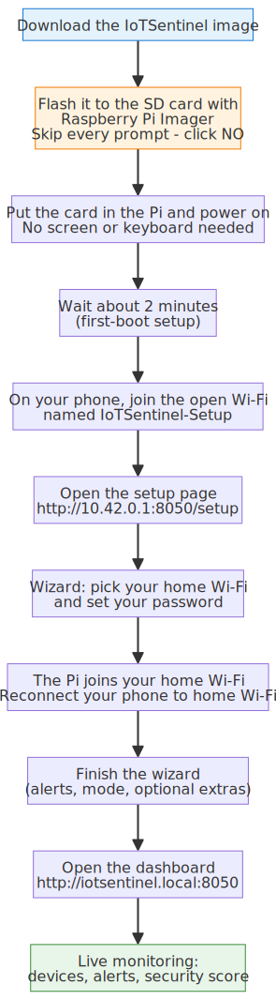

# IoTSentinel - Start Here

Welcome! This guide takes you from the file you just downloaded all the way to watching
your home network - and understanding what you're looking at. You don't need any technical
knowledge, a screen for the device, or a keyboard - just your phone or laptop. Most people
are up and running in about **10 minutes**.

**What you downloaded:**

- `IoTSentinel-<version>.img.xz` - the software for your Raspberry Pi
- `IoTSentinel-<version>.img.xz.sha256` - an optional file to check the download
- `IoTSentinel-Setup-Guide.html` - this guide

---

## The whole setup, at a glance

---

## What you need

- A **Raspberry Pi 5 (4 GB)** or **Pi 4 (4 GB or more)**
- A **microSD card**, 16 GB or larger
- The official **Raspberry Pi power supply** (a weak phone charger can stop the Wi-Fi from starting)
- A way to put the SD card into your computer (a built-in slot or a cheap USB adapter)
- Your **home Wi-Fi name and password**

---

## Step 1 - Put the software on the SD card

You'll use the free **Raspberry Pi Imager** app. The most important thing: **skip every
extra question it asks.** IoTSentinel handles Wi-Fi and your password later, in a friendly
screen on your phone.

1. Download and open **Raspberry Pi Imager** from <https://www.raspberrypi.com/software/>.
2. Put your SD card into your computer.
3. Click **CHOOSE DEVICE** and pick your Raspberry Pi model (if it isn't listed, just continue).
4. Click **CHOOSE OS**, scroll to the very bottom, and pick **Use custom**. Select the
   `IoTSentinel-<version>.img.xz` file you downloaded.
5. Click **CHOOSE STORAGE** and select your SD card. Make sure it's the SD card and not
   another drive - everything on it gets erased.
6. Click **NEXT**.
7. **Skip the customisation - this is the important part.** Imager asks
   *"Would you like to apply OS customisation settings?"* Click **NO**. Do **not** click
   "Edit Settings", and do **not** type any Wi-Fi name, username, or password here.
8. When it warns the card will be erased, click **YES** and wait about 5 minutes.

> **Why skip it?** If you enter your Wi-Fi in Imager, the Pi quietly joins your home network
> and never shows the setup screen. Leaving it blank is what makes the Pi open its own
> `IoTSentinel-Setup` network so you can set everything up from your phone.

---

## Step 2 - Turn on the Pi and open the setup screen

1. Take the SD card out of your computer and put it into the Raspberry Pi.
2. Plug in the power cable. The Pi starts on its own - **no screen, keyboard, or cable needed.**
3. Wait about **2 minutes** the first time.
4. On your **phone or laptop**, open the Wi-Fi list. A new network called
   **`IoTSentinel-Setup`** appears - it has **no password**. Tap it to connect.
5. A setup page should open automatically. If it doesn't, open your web browser and go to
   **`http://10.42.0.1:8050/setup`**.

> Don't see `IoTSentinel-Setup` after a couple of minutes? Unplug the Pi, wait 5 seconds,
> plug it back in, and wait again. Use a proper Raspberry Pi power supply.

---

## Step 3 - Follow the setup wizard

The setup runs entirely in your browser. It's a few short steps, and only the first one is
required - you can change everything else later from the dashboard.

1. **Wi-Fi and password** - Tap **Scan**, choose your home Wi-Fi from the list, type its
   password, pick **your country** (so the Wi-Fi works correctly where you live), and tap
   **Connect to this WiFi**. Then create a password for your IoTSentinel
   account - you'll use this to log in from now on.
2. **How it watches your network** - Choose **Passive** (recommended - the Pi quietly
   watches from the side, nothing else to buy) or **Gateway** (more thorough, and needs a
   small USB Wi-Fi adapter). If you're not sure, choose **Passive**; you can switch later.
3. **Who is this for?** - Pick **Household** (best for homes) or **Small Business**.
4. **Alerts** - Choose how you'd like to hear about problems. The easiest is **ntfy** -
   you'll set it up on your phone in a moment (see the next section). This is optional and
   can be done later.
5. **Use it away from home** - Optional. Turn this on to check IoTSentinel from anywhere,
   not just at home.
6. **Review and Launch** - Check your choices and tap **Launch IoTSentinel**.

> **Important - your phone will disconnect for a moment.** When you connect your home Wi-Fi
> in the first step, the Pi leaves its own `IoTSentinel-Setup` network and joins your home
> Wi-Fi. Your phone drops off `IoTSentinel-Setup` - that's normal. **Reconnect your phone to
> your usual home Wi-Fi** and the setup page carries on. If it looks stuck, reload
> `http://iotsentinel.local:8050/setup` once you're back on home Wi-Fi.

---

## Step 4 - Open your dashboard

When the wizard finishes it shows the web address for your dashboard. From any device on
your home Wi-Fi, open:

**`http://iotsentinel.local:8050`**

Log in with the password you created.

> On **Windows or Android**, if `iotsentinel.local` doesn't open, use the Pi's number address
> (like `http://192.168.1.42:8050`). The last setup screen shows it, and it's always listed
> under **Settings → Network**.

---

## Step 5 - Your first look at the dashboard

This is your home base. Everything is written in plain language - no jargon required.

- **Security score** - the big traffic-light rating at the top tells you, at a glance, how
  safe your network looks right now. Green is good; amber and red mean "take a look".
- **Your devices** - every phone, TV, speaker, camera, and gadget on your network, each with
  a plain-language note on what it is.
- **Alerts** - anything worth your attention shows up here.
- **Simple vs Advanced** - the toggle in the top bar keeps things minimal (**Simple**) or
  shows the full security console (**Advanced**). Start with **Simple**.

It takes a few minutes after first launch for every device to be discovered - that's normal.

---

## Step 6 - Get alerts on your phone (recommended)

So you don't have to keep the dashboard open, IoTSentinel can ping your phone the moment
something important happens. The quickest way is a free app called **ntfy**:

1. Install **ntfy** from your phone's app store (Apple App Store or Google Play).
2. On the dashboard, open the notifications setup (or wizard **Step 4 - Alerts**). It shows a
   **QR code** and a topic name.
3. In the ntfy app, tap **+**, then **scan the QR code** (or type the topic name).
4. That's it. Send a test alert from the dashboard to confirm your phone buzzes.

You can also use **Telegram**, **Discord**, or **email** instead - pick whatever you already
use. All of them are optional and can be set up any time from **Settings**.

---

## Step 7 - When something happens

When IoTSentinel spots something - a new device joining, an unusual connection, a known bad
address - it writes a plain-English alert and (if you set it up) notifies your phone.

For any alert you can:

- **Read it in plain English** - no codes or acronyms, just what happened and why it matters.
- **Tap "Ask Why"** - a built-in assistant explains the alert in the context of *your*
  network and suggests what to do.
- **Block the device** - one tap cuts a suspicious device off from the internet. You can
  unblock it just as easily.

If you ever want the full story behind an automated decision, the **investigation timeline**
shows every step IoTSentinel took, in order.

---

## Step 8 - Use it away from home (optional)

By default the dashboard works on your home Wi-Fi. If you turned on **remote access** in the
wizard (or later under **Settings**), you get a private web address that works from anywhere -
on mobile data, at work, on holiday. IoTSentinel uses **Tailscale** (free) to do this safely,
so you can check in on your home network wherever you are. You can also "install" the
dashboard to your phone's home screen so it behaves like a normal app.

---

## Your privacy

IoTSentinel runs **on your own device, in your own home**. It watches the *patterns* of
traffic on your network to spot trouble - it is not a cloud service mining your data. The
optional AI explanations can run **entirely on the Pi** (no accounts, no keys) if you choose
local AI in the wizard. Your data stays yours.

---

## If something goes wrong

| Problem | What to do |
|---|---|
| `IoTSentinel-Setup` doesn't appear | Wait the full 2 minutes. Then unplug the Pi, wait 5 seconds, and power it back on. Use the official power supply. If it still doesn't show, power off, put the SD card back in your computer, and open **`iotsentinel-firstboot.txt`** on the card's small `bootfs` drive - it explains exactly what happened. |
| The setup page won't load | Make sure your phone is connected to `IoTSentinel-Setup` (not your home Wi-Fi), then reload `http://10.42.0.1:8050/setup`. |
| Can't reach `iotsentinel.local` later | Use the Pi's number address shown on the last setup screen and under **Settings → Network**. |
| You moved house or changed Wi-Fi | The Pi re-opens `IoTSentinel-Setup` after a few minutes offline - reconnect and pick the new Wi-Fi, or change it under **Settings → Network**. |
| Forgot your password | Re-flash the SD card (Step 1) to start fresh. |

**More help:** the full guide and project are online at
<https://github.com/ritiksah141/iotsentinel> (see `docs/SETUP_GUIDE.md`).

---

*IoTSentinel keeps running by itself from now on, and restarts automatically if the Pi loses
power. Welcome aboard.*
