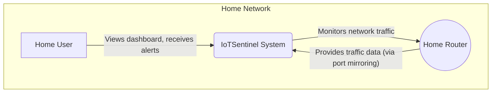
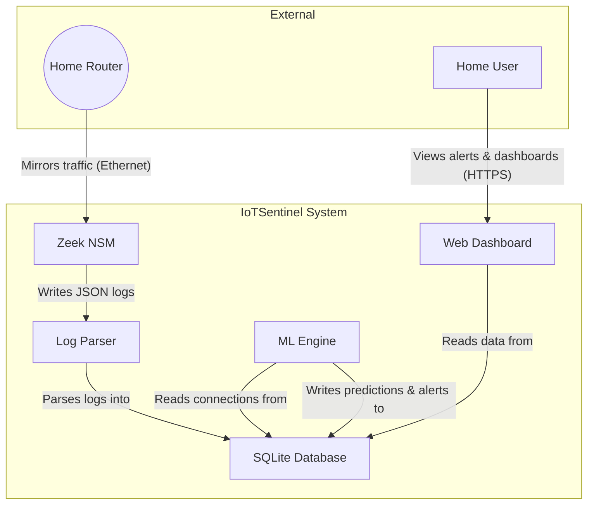
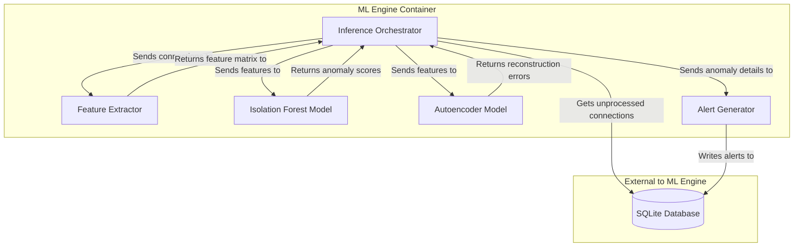
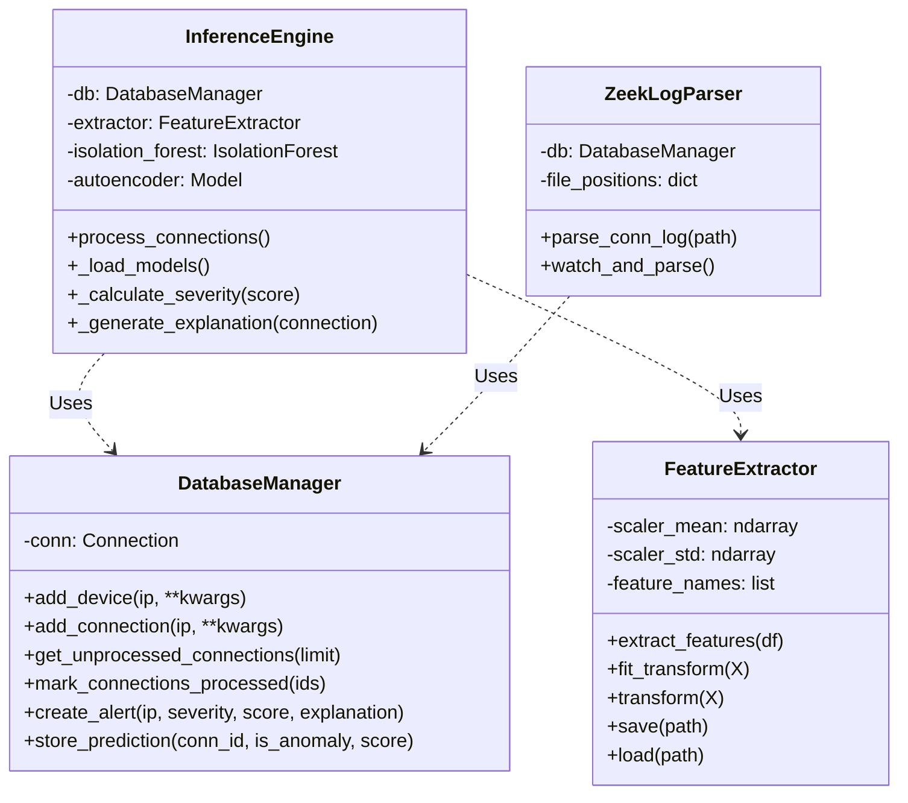

# C4 Model: Level 1 - System Context

**Diagramming Tool**: Mermaid
**Last Updated**: November 2025

This diagram provides a high-level overview of the IoTSentinel system, its users, and the external systems it interacts with.

## System Context Diagram

## Entities

### 1. Home User

- **Type**: Actor
- **Description**: The primary user of the system, typically a non-technical homeowner who wants to monitor their network for suspicious activity.
- **Interactions**:
  - Views the web dashboard to see network status and alerts.
  - Receives simplified, educational explanations of detected anomalies.
  - Manages the system (e.g., starts baseline collection, acknowledges alerts).

### 2. IoTSentinel System

- **Type**: System
- **Description**: The complete IoTSentinel application running on a Raspberry Pi. It monitors network traffic, detects anomalies using machine learning, and presents the findings on a web dashboard.
- **Responsibilities**:
  - Capturing and analyzing network traffic.
  - Storing connection metadata.
  - Training unsupervised machine learning models.
  - Detecting anomalies in real-time.
  - Generating and explaining security alerts.

### 3. Home Router

- **Type**: External System
- **Description**: The user's home internet router, which manages all network traffic.
- **Interactions**:
  - IoTSentinel monitors all traffic passing through the router. This is typically achieved by configuring the router to mirror all network traffic to the Ethernet port where the Raspberry Pi is connected.

# C4 Model: Level 2 - Container Diagram

**Diagramming Tool**: Mermaid
**Last Updated**: November 2025

This diagram zooms into the IoTSentinel system and shows its main containers (applications/services).

## Container Diagram

## Container Details

| Container           | Technology         | Responsibility                                                                  | Communication Protocols                              |
| ------------------- | ------------------ | ------------------------------------------------------------------------------- | ---------------------------------------------------- |
| **Zeek NSM**        | C++                | Analyzes raw network packets and generates structured JSON logs for events.     | Reads raw packets; Writes to local JSON files.       |
| **Log Parser**      | Python             | Watches for new Zeek logs, parses them, and inserts the data into the database. | Reads local JSON files; Writes to SQLite via SQL.    |
| **SQLite Database** | SQLite             | Provides persistent storage for all network data, predictions, and alerts.      | Accessed via file-based SQL queries.                 |
| **ML Engine**       | Python, TensorFlow | Periodically fetches new data, runs ML models, and generates alerts.            | Reads from and writes to SQLite via SQL.             |
| **Web Dashboard**   | Python, Dash       | Presents data and alerts to the user in a web interface.                        | Reads from SQLite via SQL; Serves HTTPS to the user. |

## Architectural Decisions

### ADR-001: Separation of Zeek and Python

- **Context**: We need high-performance packet analysis and flexible machine learning capabilities.
- **Decision**: Use Zeek (C++) for the heavy lifting of network analysis and Python for the data processing and ML pipeline.
- **Consequences**:
  - **Pro**: Zeek is highly optimized and can handle high traffic volumes that a pure Python solution (like one using Scapy) would struggle with.
  - **Pro**: Python provides a rich ecosystem for machine learning and data analysis.
  - **Con**: Introduces a dependency on a file-based communication channel (JSON logs), which adds some latency and complexity.

### ADR-002: Choice of SQLite

- **Context**: The system needs a simple, embedded, and reliable database that requires zero configuration.
- **Decision**: Use SQLite as the primary data store.
- **Consequences**:
  - **Pro**: Extremely easy to set up and manage, as it's just a single file. Perfect for an embedded device like a Raspberry Pi.
  - **Pro**: Sufficiently performant for the project's scale, especially with WAL (Write-Ahead Logging) mode enabled.
  - **Con**: Does not handle high levels of concurrent writes well, though this is mitigated by having separate processes for parsing and inference.

# C4 Model: Level 3 - Component Diagram (ML Engine)

**Diagramming Tool**: Mermaid
**Last Updated**: November 2025

This diagram zooms into the **ML Engine** container to show its internal components.

## ML Engine Component Diagram

## Component Details

| Component                  | Technology / Logic                          | Responsibility                                                                                                              |
| -------------------------- | ------------------------------------------- | --------------------------------------------------------------------------------------------------------------------------- |
| **Inference Orchestrator** | Python (`ml/inference_engine.py`)           | The main control loop. Fetches data from the database, coordinates the other components, and decides if an alert is needed. |
| **Feature Extractor**      | Python, Pandas (`ml/feature_extractor.py`)  | Takes raw connection data and generates over 15 numerical features (e.g., `bytes_ratio`, `hour_of_day`).                    |
| **Isolation Forest Model** | Python, scikit-learn (`data/models/...pkl`) | A pre-trained model that quickly identifies anomalies by "isolating" them. Returns a raw anomaly score.                     |
| **Autoencoder Model**      | Python, TensorFlow (`data/models/...h5`)    | A pre-trained neural network that tries to reconstruct the input features. High reconstruction error suggests an anomaly.   |
| **Alert Generator**        | Python (`ml/inference_engine.py`)           | Takes the anomaly scores and feature data to generate a human-readable explanation and a severity level for the alert.      |

## Architectural Decisions

### ADR-003: Dual-Model Approach

- **Context**: A single ML model might have blind spots. For example, Isolation Forest is fast but can be less precise, while Autoencoders are more complex but can detect more subtle anomalies.
- **Decision**: Use both an Isolation Forest and an Autoencoder model. An alert is considered "critical" only if both models flag a connection as anomalous.
- **Consequences**:
  - **Pro**: Reduces the rate of false positives, as an anomaly must be confirmed by two different modeling techniques.
  - **Pro**: Allows for a more nuanced severity scoring system.
  - **Con**: Increases computational overhead and inference time, but this is managed by batch processing.

# C4 Model: Level 4 - Code (Key Classes)

**Diagramming Tool**: Mermaid
**Last Updated**: November 2025

This diagram zooms into key components to show the main classes and their relationships.

## Class Diagram

## Class Details

### `InferenceEngine`

- **File**: `ml/inference_engine.py`
- **Responsibility**: Orchestrates the entire anomaly detection process.
- **Attributes**:
  - `db`: An instance of `DatabaseManager` to interact with the database.
  - `extractor`: An instance of `FeatureExtractor` to generate ML features.
  - `isolation_forest`, `autoencoder`: The loaded machine learning models.
- **Key Methods**:
  - `process_connections()`: The main method that fetches data, runs predictions, and creates alerts.

### `FeatureExtractor`

- **File**: `ml/feature_extractor.py`
- **Responsibility**: Converts raw connection data from the database into a numerical feature matrix suitable for machine learning.
- **Attributes**:
  - `scaler_mean`, `scaler_std`: The mean and standard deviation values for standardizing the data.
- **Key Methods**:
  - `extract_features()`: Performs the main feature engineering.
  - `fit_transform()`: Fits the scaler to the data and standardizes it.
  - `transform()`: Standardizes new data using the already-fitted scaler.

### `DatabaseManager`

- **File**: `database/db_manager.py`
- **Responsibility**: Handles all interactions with the SQLite database, providing a clean API for the rest of the application.
- **Attributes**:
  - `conn`: The active SQLite connection object.
- **Key Methods**:
  - `add_connection()`: Inserts a new connection record.
  - `get_unprocessed_connections()`: Retrieves connections that the ML engine has not yet seen.
  - `create_alert()`: Inserts a new security alert into the database.

### `ZeekLogParser`

- **File**: `capture/zeek_log_parser.py`
- **Responsibility**: Reads Zeek's JSON output logs and uses the `DatabaseManager` to persist the relevant data.
- **Attributes**:
  - `db`: An instance of `DatabaseManager`.
- **Key Methods**:
  - `parse_conn_log()`: Parses the `conn.log` file.
  - `watch_and_parse()`: Continuously monitors the log directory for new entries.
