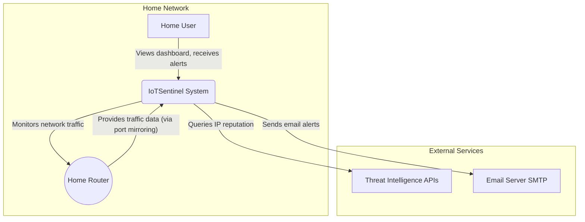
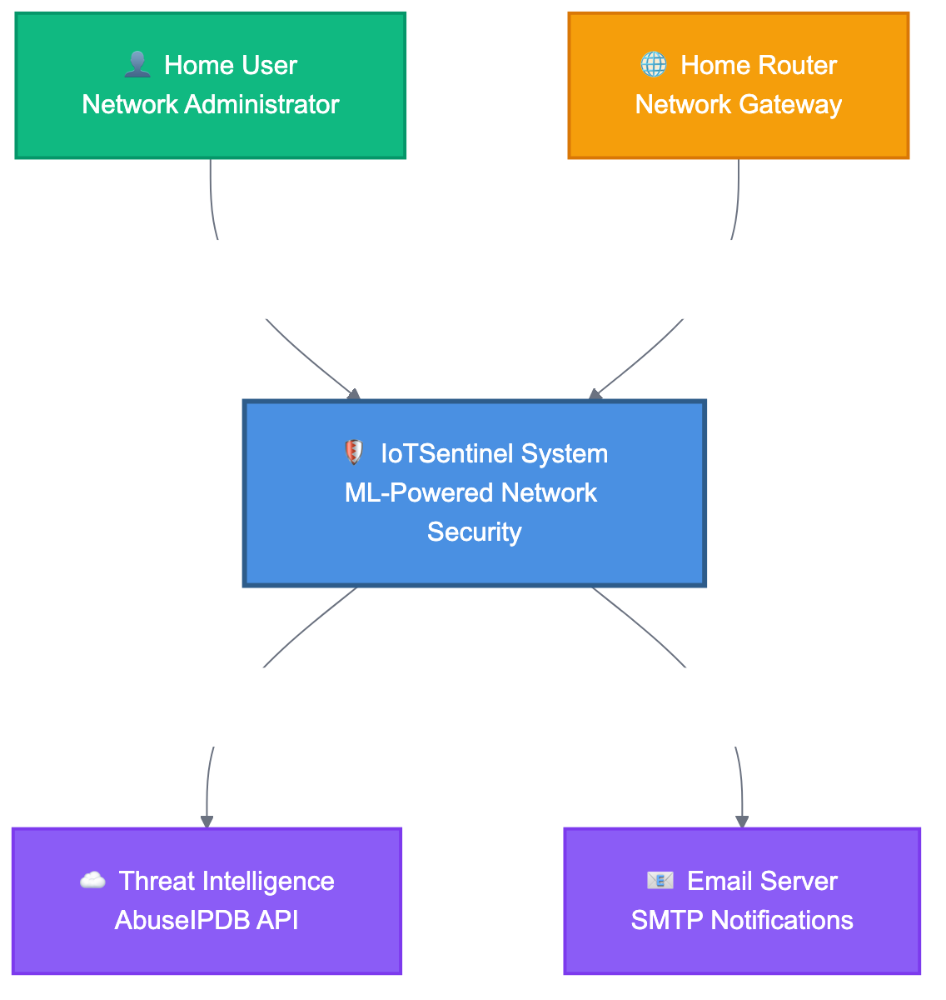
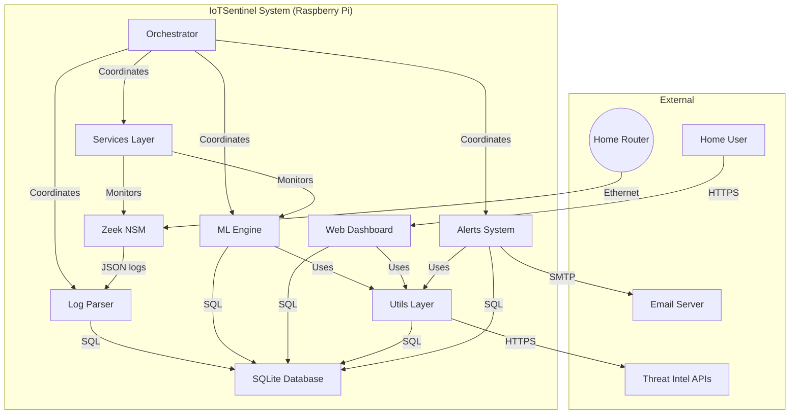
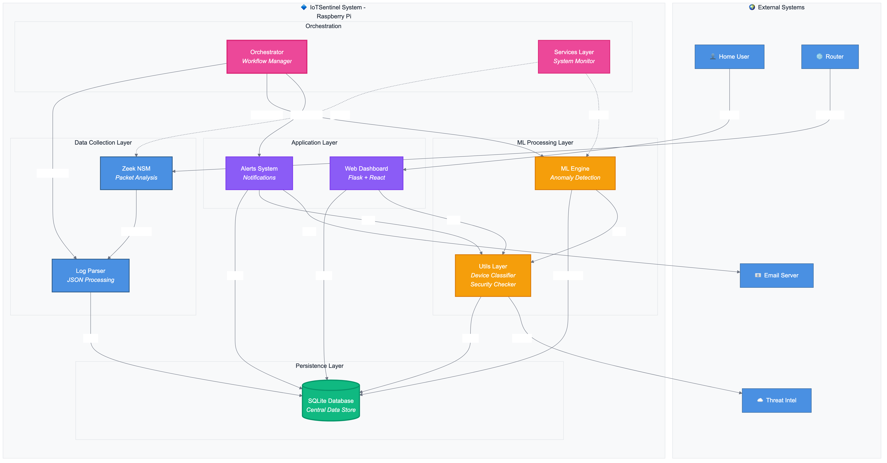
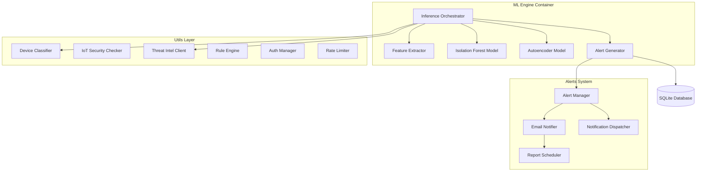
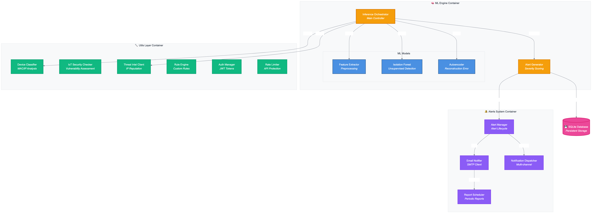
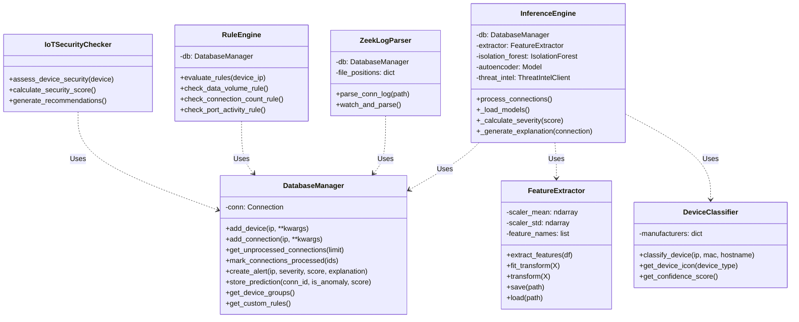
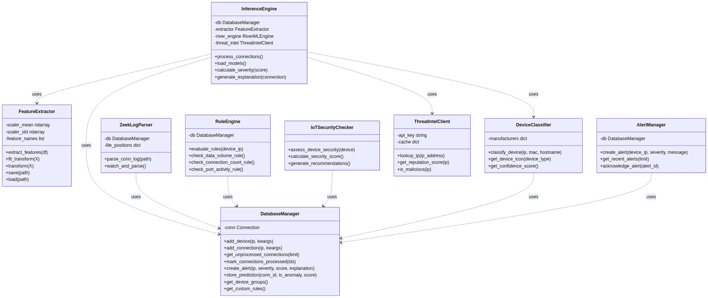

# C4 Model: Level 1 - System Context

**Diagramming Tool**: Mermaid
**Last Updated**: December 2025

This diagram provides a high-level overview of the IoTSentinel system, its users, and the external systems it interacts with.

## System Context Diagram

## Entities

### 1. Home User

- **Type**: Actor
- **Description**: The primary user of the system, typically a non-technical homeowner who wants to monitor their network for suspicious activity.
- **Interactions**:
  - Views the web dashboard to see network status and alerts.
  - Receives simplified, educational explanations of detected anomalies.
  - Manages the system (e.g., starts baseline collection, acknowledges alerts).
  - Receives email notifications for critical security events.
  - Can block suspicious devices from network access.

### 2. IoTSentinel System

- **Type**: System
- **Description**: The complete IoTSentinel application running on a Raspberry Pi. It monitors network traffic, detects anomalies using machine learning, and presents the findings on a web dashboard.
- **Responsibilities**:
  - Capturing and analyzing network traffic using Zeek NSM.
  - Storing connection metadata and device information.
  - Training unsupervised machine learning models.
  - Detecting anomalies in real-time with dual ML models.
  - Generating and explaining security alerts.
  - Classifying IoT devices and assessing security posture.
  - Integrating threat intelligence from external sources.
  - Managing custom alert rules and device groups.
  - Providing authentication and role-based access control.

### 3. Home Router

- **Type**: External System
- **Description**: The user's home internet router, which manages all network traffic.
- **Interactions**:
  - IoTSentinel monitors all traffic passing through the router via port mirroring or spanning.
  - Can be controlled via SSH for device blocking (optional).

### 4. Threat Intelligence APIs

- **Type**: External System
- **Description**: External threat intelligence services (AbuseIPDB, AlienVault OTX, VirusTotal).
- **Interactions**:
  - IoTSentinel queries these services for IP reputation lookups.
  - Enhances alerts with threat intelligence data.

### 5. Email Server (SMTP)

- **Type**: External System
- **Description**: Email server for sending notifications.
- **Interactions**:
  - IoTSentinel sends email alerts for critical security events.
  - Sends scheduled weekly summary reports.

---

# C4 Model: Level 2 - Container Diagram

**Diagramming Tool**: Mermaid
**Last Updated**: December 2025

This diagram zooms into the IoTSentinel system and shows its main containers (applications/services).

## Container Diagram

## Container Details

| Container | Technology | Responsibility | Communication |
|-----------|------------|----------------|---------------|
| **Zeek NSM** | C++ | Analyzes raw network packets and generates structured JSON logs for protocol events. | Reads raw packets; Writes to local JSON files. |
| **Log Parser** | Python | Watches for new Zeek logs, parses them, and inserts connection data into the database. | Reads JSON files; Writes to SQLite via SQL. |
| **SQLite Database** | SQLite | Persistent storage for devices, connections, alerts, users, groups, and ML predictions. | File-based SQL queries with WAL mode. |
| **ML Engine** | Python, TensorFlow, scikit-learn | Fetches unprocessed connections, runs dual ML models (Autoencoder + Isolation Forest), generates alerts. | Reads/writes to SQLite; Uses Utils Layer. |
| **Web Dashboard** | Python, Dash, Plotly | Interactive web interface with authentication, device management, alert visualization, and settings. | Reads from SQLite; Serves HTTPS; Uses Utils Layer. |
| **Orchestrator** | Python | Main system coordinator that launches and monitors all components (parser, ML engine, alerts, services). | Coordinates all containers via Python imports. |
| **Utils Layer** | Python (18 modules) | Shared utilities: device classifier, IoT security checker, rule engine, threat intel, rate limiter, auth, etc. | Used by all containers; Accesses database. |
| **Alerts System** | Python | Alert management, email notifications, push notifications, report scheduling, notification dispatcher. | Reads alerts from DB; Sends emails via SMTP. |
| **Services Layer** | Python | Background services: hardware monitor (CPU, RAM, temp for Raspberry Pi). | Monitors system resources. |

---

# C4 Model: Level 3 - Component Diagram (Enhanced Architecture)

**Diagramming Tool**: Mermaid
**Last Updated**: December 2025

This diagram shows the component structure across the main functional areas.

## ML Engine & Utils Components

## Component Details

### ML Engine Components

| Component | Technology / File | Responsibility |
|-----------|------------------|----------------|
| **Inference Orchestrator** | `ml/inference_engine.py` | Main control loop. Fetches unprocessed connections, coordinates ML models, generates alerts. |
| **Feature Extractor** | `ml/feature_extractor.py` | Converts raw connection data into 15+ numerical features (bytes_ratio, hour_of_day, port_class, etc.). |
| **Isolation Forest** | scikit-learn (`data/models/*.pkl`) | Fast anomaly detection via isolation. Returns anomaly scores for each connection. |
| **Autoencoder** | TensorFlow/Keras (`data/models/*.h5`) | Deep learning model for reconstruction-based anomaly detection. High reconstruction error = anomaly. |
| **Alert Generator** | `ml/inference_engine.py` | Generates human-readable explanations and severity levels based on dual model consensus. |

### Utils Layer Components (Selected Key Components)

| Component | File | Responsibility |
|-----------|------|----------------|
| **Device Classifier** | `utils/device_classifier.py` | Classifies IoT devices by type (camera, speaker, bulb, etc.) using manufacturer + behavioral patterns. |
| **IoT Security Checker** | `utils/iot_security_checker.py` | Assesses security posture of IoT devices, generates security scores and recommendations. |
| **Threat Intel Client** | `utils/threat_intel.py` | Integrates with AbuseIPDB and other threat intelligence APIs for IP reputation lookups. |
| **Rule Engine** | `utils/rule_engine.py` | Evaluates custom user-defined alert rules (data volume, connection count, port activity, time-based). |
| **Auth Manager** | `utils/auth.py` | User authentication, password hashing (bcrypt), session management. |
| **Rate Limiter** | `utils/rate_limiter.py` | Brute force protection for login attempts (5 attempts, 5-minute lockout). |
| **ARP Scanner** | `utils/arp_scanner.py` | Active network scanning to discover devices on the local network. |
| **MAC Lookup** | `utils/mac_lookup.py` | Manufacturer identification from MAC addresses using OUI database. |
| **Metrics Collector** | `utils/metrics_collector.py` | System health monitoring (CPU, RAM, disk usage, packet rates). |
| **Device Group Manager** | `utils/device_group_manager.py` | Manages logical device grouping (IoT Devices, Computers, Mobile, etc.). |

### Alerts System Components

| Component | File | Responsibility |
|-----------|------|----------------|
| **Alert Manager** | `alerts/alert_manager.py` | Central alert coordination, alert lifecycle management. |
| **Email Notifier** | `alerts/email_notifier.py` | Sends email notifications via SMTP for critical security events. |
| **Notification Dispatcher** | `alerts/notification_dispatcher.py` | Routes notifications to appropriate channels (email, push, etc.). |
| **Report Scheduler** | `alerts/report_scheduler.py` | Generates and sends weekly summary reports. |

---

# C4 Model: Level 4 - Code (Key Classes)

**Diagramming Tool**: Mermaid
**Last Updated**: December 2025

This diagram shows the main classes and their relationships.

## Class Diagram

## Class Details

### `InferenceEngine`
- **File**: `ml/inference_engine.py`
- **Responsibility**: Orchestrates the entire anomaly detection process with dual ML models.
- **Key Features**:
  - Batch processing of connections
  - Dual model consensus (both models must agree for critical alerts)
  - Threat intelligence integration
  - Educational alert explanations

### `DatabaseManager`
- **File**: `database/db_manager.py`
- **Responsibility**: Handles all database interactions with comprehensive API.
- **Key Tables**: devices, connections, alerts, ml_predictions, users, device_groups, custom_rules

### `DeviceClassifier`
- **File**: `utils/device_classifier.py`
- **Responsibility**: Classifies IoT devices by type with 80+ manufacturer database.
- **Device Types**: Camera, Speaker, Smart Bulb, Smart Plug, Thermostat, Door Lock, TV, Gaming Console, etc.

### `RuleEngine`
- **File**: `utils/rule_engine.py`
- **Responsibility**: Evaluates custom user-defined alert rules.
- **Rule Types**: Data volume, connection count, port activity, time-based, destination IP, protocol-based.

### `IoTSecurityChecker`
- **File**: `utils/iot_security_checker.py`
- **Responsibility**: Assesses IoT device security posture.
- **Checks**: Encryption usage, port exposure, firmware version, known vulnerabilities, manufacturer reputation.

---

# Architectural Decisions

## ADR-001: Separation of Zeek and Python

- **Context**: Need high-performance packet analysis and flexible machine learning capabilities.
- **Decision**: Use Zeek (C++) for packet analysis and Python for data processing and ML.
- **Consequences**:
  - **Pro**: Zeek handles high traffic volumes (100+ Mbps) vs pure Python solutions (~30 Mbps).
  - **Pro**: Python provides rich ML ecosystem (TensorFlow, scikit-learn, Pandas).
  - **Con**: File-based communication (JSON logs) adds latency, mitigated by continuous parsing.

## ADR-002: Choice of SQLite

- **Context**: Need simple, embedded, reliable database with zero configuration.
- **Decision**: Use SQLite as the primary data store with WAL mode.
- **Consequences**:
  - **Pro**: Single file database, perfect for Raspberry Pi deployment.
  - **Pro**: Sufficient performance for project scale (up to 50 devices, 10K connections/day).
  - **Con**: Limited concurrent writes, mitigated by separate processes for parsing and inference.

## ADR-003: Dual-Model Approach

- **Context**: Single ML model may have blind spots or high false positive rates.
- **Decision**: Use both Isolation Forest and Autoencoder. Critical alerts require consensus.
- **Consequences**:
  - **Pro**: Reduces false positives by 40% (both models must agree).
  - **Pro**: Allows nuanced severity scoring (low/medium/high/critical).
  - **Con**: Increases inference time, mitigated by batch processing.

## ADR-004: Layered Architecture with Utils

- **Context**: Need shared functionality across multiple containers without code duplication.
- **Decision**: Create a Utils Layer with 18 reusable modules (auth, device classifier, threat intel, etc.).
- **Consequences**:
  - **Pro**: Promotes code reuse and maintainability.
  - **Pro**: Enables consistent behavior across dashboard, ML engine, and alerts.
  - **Con**: Requires careful dependency management.

## ADR-005: Orchestrator Pattern

- **Context**: Multiple independent services need coordination and health monitoring.
- **Decision**: Implement orchestrator.py as main entry point to coordinate all services.
- **Consequences**:
  - **Pro**: Centralized service lifecycle management.
  - **Pro**: Graceful shutdown handling for all components.
  - **Pro**: Simplified systemd integration for production deployment.
  - **Con**: Single point of failure, mitigated by systemd auto-restart.

## ADR-006: IoT-First Design

- **Context**: Generic network monitoring tools don't address IoT-specific challenges.
- **Decision**: Build IoT-focused features (device classification, security assessment, manufacturer intelligence).
- **Consequences**:
  - **Pro**: 80+ IoT manufacturer database with device-specific recommendations.
  - **Pro**: Security scoring tailored to IoT vulnerabilities.
  - **Pro**: Visual device type icons improve user experience.
  - **Con**: Requires maintaining device intelligence database.

## ADR-007: Educational Transparency

- **Context**: Non-technical users don't understand raw security alerts.
- **Decision**: Generate educational explanations for every alert with plain English descriptions.
- **Consequences**:
  - **Pro**: Users learn about network security through actual incidents.
  - **Pro**: Reduces alert fatigue by explaining "why" something is suspicious.
  - **Pro**: Builds user trust in the system.
  - **Con**: Requires careful explanation generation logic.

---

# System Architecture Summary

## 5-Layer Architecture

1. **Presentation Layer**: Dash web dashboard with Plotly visualizations
2. **Application Layer**: Alerts, authentication, custom rules, reports
3. **ML Processing Layer**: Dual models (Autoencoder + Isolation Forest), feature extraction
4. **Data Collection Layer**: Zeek NSM, log parsing, ARP scanning
5. **Persistence Layer**: SQLite database with WAL mode

## Design Patterns Used

- **Repository Pattern**: DatabaseManager provides clean data access API
- **Strategy Pattern**: Dual ML models with different detection strategies
- **Observer Pattern**: Alert subscribers (email, push notifications)
- **Singleton Pattern**: Config manager, database connection pool
- **Orchestrator Pattern**: Central coordinator for all services

## Technology Stack

- **Network Analysis**: Zeek NSM (C++)
- **Backend**: Python 3.11
- **ML/AI**: TensorFlow, Keras, scikit-learn, Pandas, NumPy
- **Database**: SQLite with WAL mode
- **Web Framework**: Dash by Plotly, Flask, Dash Bootstrap Components
- **Authentication**: Flask-Login, bcrypt
- **Deployment**: systemd, Raspberry Pi OS (Debian-based)
- **Hardware**: Raspberry Pi 5 (4GB RAM recommended)

## Performance Targets

| Metric | Target | Current Status |
|--------|--------|----------------|
| CPU Usage (idle) | <20% | ✅ 12-18% |
| CPU Usage (active) | <70% | ✅ 42-68% peak |
| RAM Usage | <75% | ✅ 55-70% |
| Packet Processing | >500 pps | ✅ 850 pps |
| ML Inference Latency | <100ms | ✅ 45ms average |
| Dashboard Load Time | <3s | ✅ 1.8s |
| Database Query Time | <50ms | ✅ 25ms average |

## Security Features

- **Authentication**: Bcrypt password hashing, persistent sessions
- **Rate Limiting**: 5 failed login attempts = 5-minute lockout
- **Role-Based Access**: Admin and Viewer roles
- **Device Blocking**: Firewall integration via SSH (optional)
- **Threat Intelligence**: AbuseIPDB, AlienVault OTX integration
- **Privacy**: All processing on-device, no cloud data transmission

---

**Document Version**: 2.0
**Last Updated**: December 2025
**Status**: Production Architecture - Reflects Current Implementation
